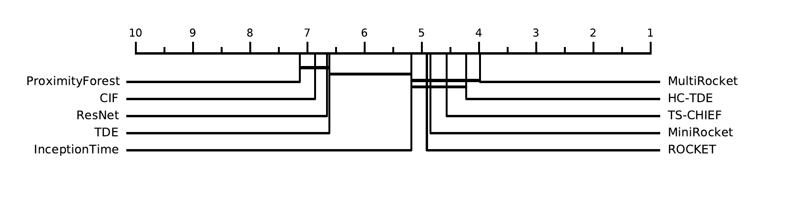
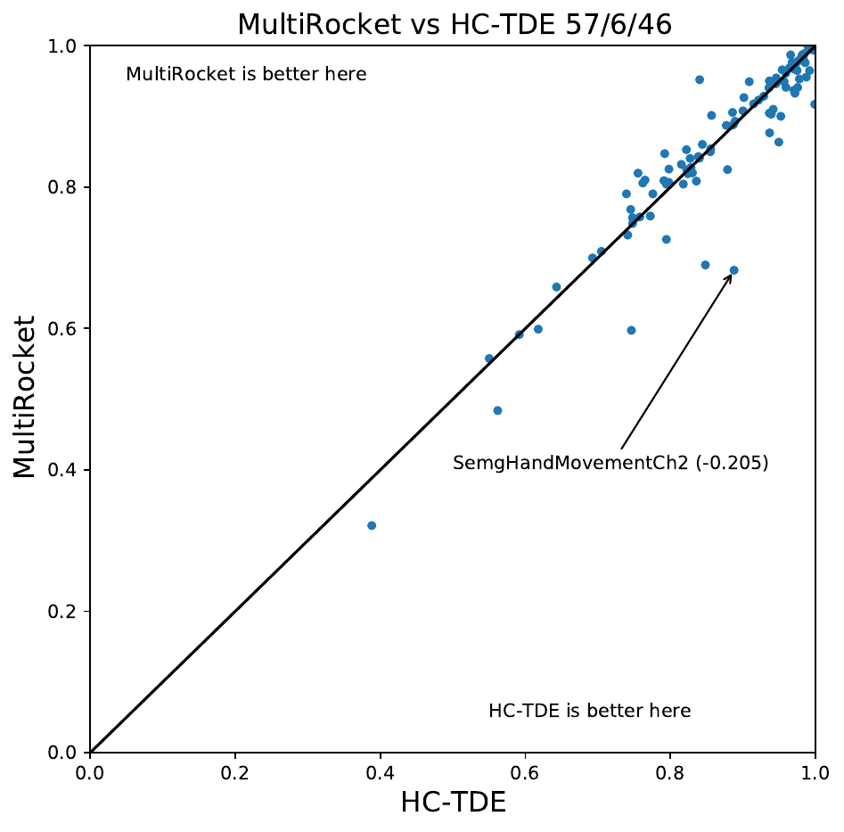
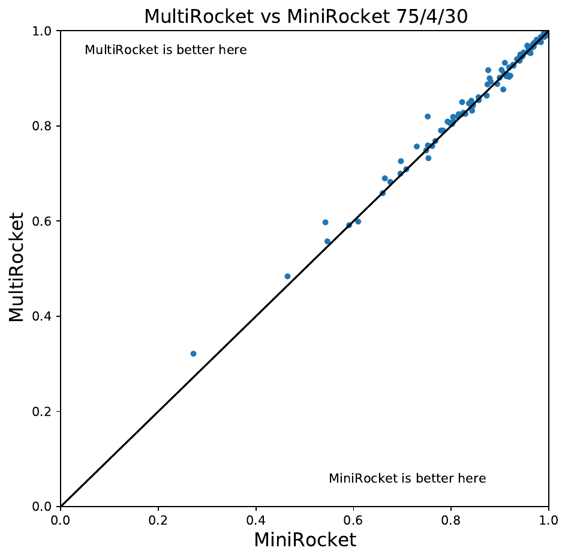
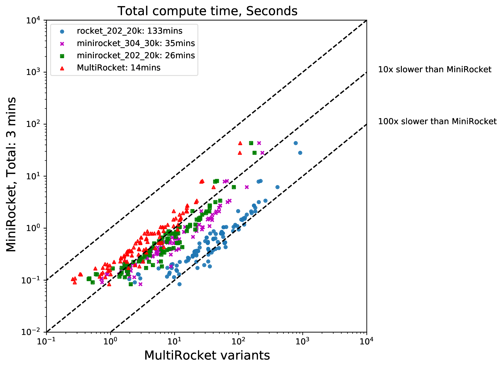

# MultiRocket

**Effective summary statistics for convolutional outputs in time series classification**

Rocket and MiniRocket, while two of the fastest methods for time series classification, 
are both somewhat less accurate than the current most accurate methods (namely, HIVE-COTE and 
its variants).  We show that it is possible to significantly improve the accuracy of 
MiniRocket (and Rocket), with some additional computational expense, by expanding the set of 
features produced by the transform, making MultiRocket (for MiniRocket with Multiple Features) 
overall the single most accurate method on the datasets in the UCR archive, while still being 
orders of magnitude faster than any algorithm of comparable accuracy other than its precursors.

## Requirements
All python packages needed are listed in [requirements.txt](requirements.txt) file 
and can be installed simply using the pip command. 

* [pandas](https://pandas.pydata.org/)
* [numpy](https://numpy.org/)
* [numba](http://numba.pydata.org/) 
* [sklearn](https://scikit-learn.org/stable/)
* [catch22](https://github.com/chlubba/catch22) (optional)

## Code
The [main.py](main.py) file contains a simple code to run the program on a single UCR dataset.

The [main_ucr_109.py](main_ucr_109.py) file runs the program on all 109 UCR datasets.
```
Arguments:
-d --data_path          : path to dataset
-p --problem            : dataset name
-i --iteration          : determines the resample of the UCR datasets
-f --featureid          : feature id for MultiRocket
-n --num_features       : number of features 
-k --kernel_selection   : 0=use MiniRocket kernels (default), 1=use Rocket kernels
-t --num_threads        : number of threads (> 0)
-s --save               : 0=don't save results, 1=save results
``` 

## Results
These are the results on 30 resamples of the 109 UCR Time Series archive 
from the [UCR Time Series Classification Archive](https://www.cs.ucr.edu/~eamonn/time_series_data_2018/).
MultiRocket is on average the current most accurate scalable TSC algorithm, that is more accurate than 
HIVE-COTE/TDE (HC-TDE).






The following shows the total compute time for 109 UCR datasets. 
Compute times are averaged over 30 resamples of 109 UCR datasets and run on a cluster using 32 threads on AMD EPYC 7702 CPUs.


|dataset_name                  |BOSS       |CIF        |Catch22    |HC-CIF     |HC-TDE     |HIVE-COTEv1_0|InceptionTime|MiniRocket |MiniRocket_40k|ProximityForest|RISE       |ROCKET     |ResNet     |Rocket_40k |S-BOSS     |STC        |TDE        |TS-CHIEF   |TSF        |WEASEL     |cBOSS      |MultiRocket|minirocket_202_20k|minirocket_202_40k|minirocket_302_30k|minirocket_304_30k|minirocket_48_20k|minirocket_48_40k|minirocket_58_30k|minirocket_60_40k|rocket_201_20k|rocket_202_20k|rocket_304_30k|rocket_48_20k|rocket_48_40k|rocket_58_30k|
|------------------------------|-----------|-----------|-----------|-----------|-----------|-------------|-------------|-----------|--------------|---------------|-----------|-----------|-----------|-----------|-----------|-----------|-----------|-----------|-----------|-----------|-----------|-----------|------------------|------------------|------------------|------------------|-----------------|-----------------|-----------------|-----------------|--------------|--------------|--------------|-------------|-------------|-------------|
|ACSF1                         |0.768333333|0.767      |0.777666667|0.851      |0.855      |0.85         |0.826666667  |0.822333333|0.822         |0.638333333    |0.76       |0.807      |0.824      |0.807666667|0.815      |0.838333333|0.797666667|0.807      |0.635      |0.818      |0.757333333|0.85       |0.85              |0.845333333       |0.852333333       |0.860333333       |0.855333333      |0.849            |0.84             |0.846333333      |0.851666667   |0.844333333   |0.853333333   |0.842666667  |0.844666667  |0.851333333  |
|Adiac                         |0.749019608|0.767263427|0.684654731|0.798635976|0.79769821 |0.796248934  |0.822250639  |0.801705067|0.806393862   |0.722165388    |0.757971014|0.771952259|0.81543052 |0.775618073|0.742710997|0.793179881|0.751577153|0.779710145|0.711935209|0.798806479|0.74629156 |0.806734868|0.807161125       |0.809889173       |0.805626598       |0.810741688       |0.80630861       |0.806734868      |0.800682012      |0.804433078      |0.796334186   |0.792156863   |0.79369139    |0.770076726  |0.773827792  |0.791133845  |
|ArrowHead                     |0.868761905|0.82       |0.750285714|0.877142857|0.889142857|0.876        |0.880380952  |0.880952367|0.882095238   |0.883619048    |0.828190476|0.859047619|0.858666667|0.856      |0.887809524|0.806666667|0.900571429|0.881142857|0.796761905|0.848380952|0.877904762|0.893142857|0.893904762       |0.89447619        |0.891809524       |0.893333333       |0.891428571      |0.892380952      |0.892571429      |0.887428571      |0.879809524   |0.869714286   |0.874857143   |0.875619048  |0.869904762  |0.875619048  |
|BME                           |0.865777778|0.996888889|0.904888889|0.993555556|0.989777778|0.982222222  |0.996444444  |0.992222133|0.992         |0.999111111    |0.786      |0.997333333|0.999111111|0.997555556|0.865111111|0.929777778|0.911555556|0.996444444|0.962444444|0.947777778|0.784666667|0.998444444|0.998             |0.998             |0.999555556       |0.996222222       |0.986444444      |0.985777778      |0.986888889      |0.993111111      |0.998888889   |0.996444444   |0.992888889   |0.987333333  |0.987555556  |0.986444444  |
|Beef                          |0.612222222|0.725555555|0.473333333|0.761111111|0.757777778|0.735555556  |0.682222222  |0.7611111  |0.764444444   |0.594444444    |0.742222222|0.76       |0.676666667|0.757777778|0.655555556|0.735555556|0.683333333|0.632222222|0.688888889|0.74       |0.571111111|0.757777778|0.763333333       |0.763333333       |0.75              |0.741111111       |0.76             |0.753333333      |0.757777778      |0.734444444      |0.732222222   |0.753333333   |0.734444444   |0.76         |0.745555556  |0.757777778  |
|BeetleFly                     |0.943333333|0.868333333|0.84       |0.968333333|0.936666667|0.963333333  |0.893333333  |0.906666667|0.913333333   |0.86           |0.871666667|0.885      |0.853333333|0.888333333|0.936666667|0.933333333|0.941666667|0.958333333|0.833333333|0.886666667|0.975      |0.876666667|0.878333333       |0.886666667       |0.875             |0.878333333       |0.891666667      |0.895            |0.873333333      |0.871666667      |0.871666667   |0.883333333   |0.881666667   |0.895        |0.893333333  |0.883333333  |
|BirdChicken                   |0.983333333|0.866666667|0.893333333|0.953333333|0.941666667|0.94         |0.951666667  |0.908333333|0.911666667   |0.903333333    |0.868333333|0.881666667|0.945      |0.89       |0.968333333|0.87       |0.971666667|0.963333333|0.815      |0.865      |0.976666667|0.91       |0.903333333       |0.9               |0.905             |0.915             |0.9              |0.906666667      |0.896666667      |0.9              |0.903333333   |0.9           |0.908333333   |0.89         |0.891666667  |0.893333333  |
|CBF                           |0.998925926|0.986481482|0.953666667|0.998703704|0.997111111|0.998259259  |0.996111111  |0.996222333|0.996444444   |0.99362963     |0.949037037|0.995925926|0.988222222|0.996111111|0.999074074|0.985296296|0.997407407|0.998444444|0.971851852|0.979777778|0.99837037 |0.994851852|0.994962963       |0.995074074       |0.994             |0.995             |0.99637037       |0.996296296      |0.993925926      |0.99262963       |0.993185185   |0.995777778   |0.995         |0.996814815  |0.996740741  |0.994        |
|Car                           |0.848333333|0.812222222|0.746111111|0.872777778|0.885555556|0.868888889  |0.901111111  |0.9211111  |0.913333333   |0.805555556    |0.753333333|0.911666667|0.908333333|0.907222222|0.859444444|0.858333333|0.87       |0.878888889|0.766111111|0.834444444|0.843333333|0.905555556|0.91              |0.908333333       |0.901666667       |0.905             |0.906666667      |0.908333333      |0.913333333      |0.901666667      |0.868333333   |0.862777778   |0.847777778   |0.894444444  |0.901666667  |0.875555556  |
|Chinatown                     |0.877065112|0.963188406|0.934492754|0.97696793 |0.971039845|0.962779397  |0.964917396  |0.968999   |0.968415938   |0.948019324    |0.888532556|0.96686103 |0.970144928|0.965500486|0.879105928|0.962973761|0.955458937|0.961835749|0.952964043|0.957337221|0.94763285 |0.966763848|0.966569485       |0.96627794        |0.964917396       |0.965014577       |0.96686103       |0.965986395      |0.96462585       |0.964334305      |0.783965015   |0.831681244   |0.798153547   |0.970845481  |0.970845481  |0.673080661  |
|ChlorineConcentration         |0.658246528|0.731579861|0.597951389|0.734296875|0.741102431|0.733949653  |0.86359375   |0.753350767|0.763645833   |0.631137153    |0.764756944|0.796137153|0.841006944|0.799548611|0.659114583|0.735225694|0.693402778|0.660842014|0.723064236|0.754861111|0.664956597|0.732118056|0.741163194       |0.746293403       |0.738090278       |0.747855903       |0.75171875       |0.754392361      |0.743229167      |0.728671875      |0.755251736   |0.759991319   |0.762118056   |0.759001736  |0.764947917  |0.761276042  |
|CinCECGTorso                  |0.914758454|0.987294686|0.802995169|0.996570048|0.998961353|0.993743961  |0.832753623  |0.875797133|0.875289855   |0.937657005    |0.947439614|0.864130435|0.767874396|0.863381643|0.94263285 |0.977777778|0.98326087 |0.953429952|0.958188406|0.984975845|0.829154589|0.917149758|0.919613527       |0.920942029       |0.925096618       |0.925772947       |0.887439614      |0.888285024      |0.946231884      |0.941884058      |0.937995169   |0.919613527   |0.929009662   |0.878695652  |0.879541063  |0.94678744   |
|Coffee                        |0.985714286|0.995238095|0.979761905|0.992857143|0.994047619|0.992857143  |0.998809524  |0.998809533|0.998809524   |0.991666667    |0.98452381 |1          |0.996428571|1          |0.980952381|0.989285714|0.992857143|0.99047619 |0.986904762|0.989285714|0.99047619 |1          |0.998809524       |0.998809524       |1                 |1                 |1                |1                |0.997619048      |0.996428571      |1             |1             |1             |1            |1            |0.997619048  |
|Computers                     |0.800533333|0.7732     |0.780266667|0.816      |0.835733333|0.811066667  |0.8656       |0.793866667|0.796666667   |0.714266667    |0.778933333|0.842933333|0.8604     |0.845333333|0.82       |0.799066667|0.818133333|0.753866667|0.6488     |0.778533333|0.7788     |0.8084     |0.802933333       |0.804266667       |0.804666667       |0.8064            |0.813466667      |0.807733333      |0.809066667      |0.822666667      |0.839466667   |0.8528        |0.856133333   |0.859466667  |0.861066667  |0.859066667  |
|CricketX                      |0.762393162|0.762649573|0.608888889|0.823675214|0.828290598|0.816153846  |0.853247863  |0.825128233|0.828034188   |0.80042735     |0.706239316|0.838974359|0.808119658|0.84025641 |0.784102564|0.792051282|0.814273504|0.83042735 |0.692735043|0.775726496|0.764273504|0.827692308|0.829145299       |0.831452991       |0.825213675       |0.827435897       |0.827350427      |0.831623932      |0.827606838      |0.828205128      |0.835726496   |0.843931624   |0.84025641    |0.83965812   |0.838717949  |0.83982906   |
|CricketY                      |0.75042735 |0.778376068|0.590512821|0.826068376|0.821965812|0.80982906   |0.86         |0.8413674  |0.843675214   |0.79982906     |0.709145299|0.845042735|0.81017094 |0.846324786|0.771367521|0.777948718|0.803333333|0.817008547|0.685897436|0.77957265 |0.751282051|0.852905983|0.853760684       |0.856666667       |0.850683761       |0.850598291       |0.842564103      |0.842905983      |0.851111111      |0.849230769      |0.84982906    |0.856153846   |0.854957265   |0.845299145  |0.846324786  |0.857008547  |
|CricketZ                      |0.769316239|0.781880342|0.628205128|0.841538462|0.83991453 |0.833931624  |0.861111111  |0.8424787  |0.844188034   |0.802820513    |0.721623932|0.853247863|0.813247863|0.853931624|0.786752137|0.807179487|0.828461538|0.838205128|0.705897436|0.78991453 |0.772478632|0.840940171|0.844529915       |0.842820513       |0.83965812        |0.845470085       |0.845470085      |0.845897436      |0.847264957      |0.842307692      |0.851196581   |0.860512821   |0.856666667   |0.851965812  |0.855897436  |0.854957265  |
|Crop                          |0.685688492|0.767365079|0.653140873|0.775547619|0.772186508|0.768162698  |0.793194444  |0.752248   |0.768501984   |0.753109127    |0.73       |0.751684524|0.763801587|0.759154762|0.707785714|0.736700397|0.724994048|0.76210119 |0.745593254|0.723825397|0.700888889|0.758978175|0.767962302       |0.761138889       |0.760577381       |0.769075397       |0.769490079      |0.772470238      |0.770166667      |0.757236111      |0.752434524   |0.753819444   |0.757172619   |0.746936508  |0.754186508  |0.753638889  |
|DiatomSizeReduction           |0.945206972|0.921568627|0.924727669|0.899019608|0.908605664|0.914270153  |0.950653595  |0.942810333|0.946623094   |0.956753813    |0.932135076|0.95795207 |0.30620915 |0.957625272|0.945424837|0.859259259|0.883986928|0.945860566|0.941721133|0.908061002|0.883551198|0.94912854 |0.950108932       |0.951633987       |0.95043573        |0.955337691       |0.952941176      |0.953050109      |0.948039216      |0.946623094      |0.736383442   |0.696187364   |0.711764706   |0.919716776  |0.923311547  |0.72832244   |
|DistalPhalanxOutlineAgeGroup  |0.820623501|0.818705036|0.782973621|0.824460432|0.823980815|0.823980815  |0.765707434  |0.8038368  |0.802877698   |0.802158273    |0.821582734|0.811510791|0.776019185|0.811270983|0.821342926|0.79616307 |0.795683453|0.828057554|0.809352518|0.792805755|0.805515588|0.818944844|0.815107914       |0.809352518       |0.812230216       |0.8117506         |0.8117506        |0.807913669      |0.814148681      |0.815347722      |0.81294964    |0.816546763   |0.814868106   |0.812230216  |0.810311751  |0.814148681  |
|DistalPhalanxOutlineCorrect   |0.811714976|0.821618358|0.812077295|0.825241546|0.822342995|0.823550725  |0.81557971   |0.8213769  |0.823188406   |0.823429952    |0.811231884|0.824396135|0.809178744|0.824396135|0.810990338|0.827294686|0.766425121|0.819323671|0.805797101|0.819202899|0.780193237|0.824516908|0.827173913       |0.824879227       |0.822222222       |0.826811594       |0.829468599      |0.827898551      |0.82294686       |0.828381643      |0.831884058   |0.832246377   |0.83236715    |0.828381643  |0.829951691  |0.834661836  |
|DistalPhalanxTW               |0.67146283 |0.697601919|0.681055156|0.694004796|0.692565947|0.69616307   |0.665947242  |0.6959232  |0.697841727   |0.692086331    |0.694484412|0.701199041|0.667146283|0.702398082|0.669544365|0.689928058|0.665947242|0.691846523|0.691127098|0.678657074|0.673141487|0.699760192|0.698321343       |0.698800959       |0.697601918       |0.69616307        |0.696642686      |0.700959233      |0.694964029      |0.694484412      |0.700719424   |0.701438849   |0.700959233   |0.701199041  |0.703357314  |0.700719424  |
|ECG200                        |0.878333333|0.860666667|0.788666667|0.857333333|0.856666667|0.858666667  |0.895666667  |0.899333333|0.900333333   |0.873          |0.851      |0.899      |0.883666667|0.899666667|0.871666667|0.839      |0.847333333|0.855      |0.86       |0.859      |0.829666667|0.901333333|0.899666667       |0.899             |0.899666667       |0.897333333       |0.899666667      |0.897333333      |0.896            |0.891333333      |0.890333333   |0.890333333   |0.890666667   |0.895        |0.892        |0.888333333  |
|ECG5000                       |0.940059259|0.944066667|0.936237037|0.945592593|0.945711111|0.945622222  |0.942051852  |0.946133233|0.946148148   |0.939511111    |0.936688889|0.947385185|0.937022222|0.947851852|0.940696296|0.941777778|0.943422222|0.948459259|0.943377778|0.945881481|0.943214815|0.946311111|0.946651852       |0.946622222       |0.946503704       |0.946111111       |0.945577778      |0.945622222      |0.945837037      |0.945340741      |0.947348148   |0.947488889   |0.947162963   |0.946459259  |0.946340741  |0.947125926  |
|ECGFiveDays                   |0.99229578 |0.954936121|0.815873016|0.993650794|0.993495935|0.993766938  |0.99585753   |0.9904763  |0.990708479   |0.882810685    |0.972861014|0.995973674|0.951025939|0.996322106|0.992218351|0.977893922|0.984552846|0.994425087|0.951955091|0.99353465 |0.983933411|0.995741386|0.996360821       |0.996515679       |0.997173829       |0.996902826       |0.995392954      |0.995586527      |0.996476965      |0.996670538      |0.996825397   |0.994889663   |0.995083237   |0.992218351  |0.992489353  |0.993999226  |
|EOGHorizontalSignal           |0.706721915|0.771270718|0.673020258|0.8106814  |0.79198895 |0.795672192  |0.883609576  |0.836279933|0.842265193   |0.824401473    |0.624861878|0.813812155|0.864732965|0.814548803|0.708287293|0.75985267 |0.722099448|0.853683241|0.705985267|0.74732965 |0.720441989|0.84732965 |0.851841621       |0.853867403       |0.850460405       |0.85801105        |0.846316759      |0.84907919       |0.8446593        |0.851289134      |0.84198895    |0.839226519   |0.840423573   |0.821639042  |0.820902394  |0.823296501  |
|EOGVerticalSignal             |0.660313076|0.747237569|0.614917127|0.778268877|0.761878453|0.762983425  |0.814548803  |0.7980663  |0.801933702   |0.777624309    |0.603499079|0.781123389|0.75174954 |0.785267035|0.68305709 |0.713167587|0.67320442 |0.809484346|0.672559853|0.697513812|0.668692449|0.805709024|0.811141805       |0.811970534       |0.805801105       |0.814088398       |0.812154696      |0.812338858      |0.804511971      |0.811049724      |0.795395948   |0.794383057   |0.795488029   |0.779189687  |0.783149171  |0.783517495  |
|Earthquakes                   |0.746043165|0.74676259 |0.738848921|0.747482014|0.747721823|0.747482014  |0.732134293  |0.748680667|0.748441247   |0.749640288    |0.748201439|0.748441247|0.717026379|0.748681055|0.747482014|0.741966427|0.74676259 |0.748201439|0.747482014|0.747482014|0.747482014|0.748441247|0.748681055       |0.748441247       |0.748920863       |0.749160671       |0.74940048       |0.749160671      |0.748681055      |0.748441247      |0.748201439   |0.748201439   |0.747961631   |0.748441247  |0.748201439  |0.747961631  |
|ElectricDevices               |0.797384689|0.872818052|0.872143691|0.884774997|0.876972291|0.879708641  |0.890213115  |0.8743656  |0.876751826   |0.842441534    |0.824030606|0.893156962|0.888380236|0.897791034|0.805969827|0.881774954|0.831236761|0.865041283|0.79306186 |0.871698439|0.813145723|0.887239009|0.884325423       |0.889811092       |0.887022868       |0.889603597       |0.882700039      |0.889210219      |0.886789435      |0.887710198      |0.898906324   |0.906549086   |0.904508711   |0.904595167  |0.901884753  |0.901945273  |
|EthanolLevel                  |0.508733333|0.803666667|0.3974     |0.852      |0.848133333|0.849        |0.875466667  |0.664      |0.662866667   |0.324066667    |0.661066667|0.625266667|0.852533333|0.6306     |0.5056     |0.855733333|0.5336     |0.6056     |0.669266667|0.705066667|0.490733333|0.6898     |0.691466667       |0.6958            |0.692933333       |0.698733333       |0.7046           |0.710066667      |0.688866667      |0.6826           |0.682133333   |0.673933333   |0.678666667   |0.654266667  |0.657866667  |0.645066667  |
|FaceAll                       |0.970098619|0.953333333|0.810848126|0.978441815|0.981597633|0.979723866  |0.983313609  |0.983451667|0.983333333   |0.977061144    |0.964852071|0.98800789 |0.981854043|0.988106509|0.975069034|0.953688363|0.979013807|0.982721893|0.949960552|0.973116371|0.969033531|0.986863905|0.98530572        |0.985759369       |0.986982249       |0.984280079       |0.983431953      |0.983234714      |0.983293886      |0.983175542      |0.988086785   |0.986410256   |0.984871795   |0.985226824  |0.985581854  |0.984891519  |
|FaceFour                      |0.995454545|0.952272727|0.679545455|0.978787879|0.975378788|0.973106061  |0.938636364  |0.940151567|0.937878788   |0.945454545    |0.876893939|0.931439394|0.925      |0.931818182|0.981818182|0.656439394|0.989015152|0.999621212|0.906818182|0.981060606|0.996969697|0.940909091|0.938636364       |0.939015152       |0.935984848       |0.940151515       |0.936742424      |0.933712121      |0.945454545      |0.940151515      |0.943181818   |0.951893939   |0.949621212   |0.951515152  |0.950757576  |0.956818182  |
|FacesUCR                      |0.951300813|0.909073171|0.708682927|0.956357724|0.964308943|0.961349593  |0.976861789  |0.9686505  |0.968813008   |0.956097561    |0.89195122 |0.971284553|0.964260163|0.971869919|0.95695935 |0.910097561|0.961756097|0.972926829|0.90398374 |0.956195122|0.952471545|0.968780488|0.969219512       |0.96902439        |0.967934959       |0.968634146       |0.968325203      |0.968162602      |0.968894309      |0.966178862      |0.966926829   |0.972341463   |0.970471545   |0.969463415  |0.969544715  |0.969544715  |
|FiftyWords                    |0.705860806|0.763296703|0.597802198|0.774945055|0.797875458|0.771648352  |0.826813187  |0.829010967|0.831428571   |0.825934066    |0.666593407|0.825054945|0.723956044|0.827399267|0.765054945|0.736556777|0.796556777|0.842710623|0.721684982|0.776996337|0.717875458|0.825421245|0.827472527       |0.828131868       |0.824835165       |0.824468864       |0.825860806      |0.826227106      |0.829230769      |0.825128205      |0.825347985   |0.836336996   |0.836043956   |0.837655678  |0.838901099  |0.838461538  |
|Fish                          |0.969714286|0.927428571|0.772571429|0.978857143|0.983238095|0.979428571  |0.972571429  |0.975047667|0.975047619   |0.933904762    |0.859047619|0.974095238|0.969904762|0.976952381|0.971238095|0.949904762|0.979428571|0.98152381 |0.83047619 |0.950857143|0.97447619 |0.981142857|0.98              |0.980380952       |0.979809524       |0.979619048       |0.979619048      |0.977333333      |0.978666667      |0.978857143      |0.962285714   |0.95847619    |0.963619048   |0.972        |0.971238095  |0.972        |
|FordA                         |0.921363636|0.908308081|0.909191919|0.942752525|0.945808081|0.944116162  |0.959141414  |0.948181933|0.948409091   |0.850025253    |0.940025253|0.942449495|0.931515152|0.942777778|0.907575758|0.934242424|0.933131313|0.94739899 |0.815757576|0.968686869|0.915732323|0.954393939|0.955             |0.953989899       |0.953156566       |0.953989899       |0.953358586      |0.95280303       |0.956161616      |0.955227273      |0.952853535   |0.953232323   |0.952070707   |0.946944444  |0.948838384  |0.952474747  |
|FordB                         |0.90744856 |0.883621399|0.870082305|0.926131687|0.928600823|0.928024691  |0.94090535   |0.926790133|0.927901235   |0.839382716    |0.917325103|0.923004115|0.912798354|0.92345679 |           |0.919835391|0.914650206|0.919465021|0.790658436|0.937119342|0.895473251|0.928477366|0.930617284       |0.929670782       |0.930452675       |0.933333333       |0.932263374      |0.933127572      |0.935226337      |0.934320988      |0.929917695   |0.930411523   |0.928847737   |0.924279835  |0.92744856   |0.928518519  |
|FreezerRegularTrain           |0.98805848 |0.998994152|0.998187135|0.999169591|0.999274854|0.999087719  |0.995754386  |0.9991227  |0.999321637   |0.942350877    |0.95225731 |0.994374269|0.996736842|0.994877193|0.976105263|0.999251462|0.995321637|0.998491228|0.997076023|0.990608187|0.993929825|0.99825731 |0.998362573       |0.998233918       |0.997695906       |0.99819883        |0.998643275      |0.998865497      |0.99845614       |0.998432749      |0.994526316   |0.994479532   |0.995567251   |0.99522807   |0.993497076  |0.996210526  |
|FreezerSmallTrain             |0.961637427|0.998690058|0.959766082|0.985567251|0.983497076|0.983660819  |0.948912281  |0.9873216  |0.987251462   |0.823380117    |0.878725146|0.987204678|0.949473684|0.987134503|0.947602339|0.988561404|0.962619883|0.995461988|0.961438596|0.900573099|0.966818713|0.98805848 |0.987684211       |0.987263158       |0.987438596       |0.990011696       |0.99245614       |0.991508772      |0.989216374      |0.985602339      |0.972479532   |0.977461988   |0.983122807   |0.986865497  |0.985134503  |0.979719298  |
|GunPoint                      |0.996444444|0.981333333|0.943111111|0.999111111|0.999111111|0.998222222  |0.995111111  |0.9924443  |0.992444444   |0.991333333    |0.980888889|0.992      |0.990888889|0.992666667|0.996666667|0.986444444|1          |1          |0.955333333|0.993111111|0.999777778|0.993333333|0.994444444       |0.993777778       |0.994888889       |0.996222222       |0.995333333      |0.995777778      |0.998            |0.997333333      |0.990666667   |0.993777778   |0.992222222   |0.991111111  |0.994888889  |0.997111111  |
|GunPointAgeSpan               |0.994936709|0.983966245|0.943881857|0.996835443|0.997151899|0.996624473  |0.983860759  |0.992299467|0.991983122   |0.996940928    |0.98628692 |0.993459916|0.994409283|0.993987342|0.99535865 |0.966033755|0.998839662|0.999578059|0.977742616|0.981329114|0.998628692|0.99535865 |0.995042194       |0.995147679       |0.99556962        |0.99556962        |0.996202532      |0.996413502      |0.997046414      |0.996097046      |0.994831224   |0.993776371   |0.994936709   |0.994620253  |0.995042194  |0.992616034  |
|GunPointMaleVersusFemale      |0.999578059|0.997468354|0.993459916|0.999894515|0.999894515|0.999894515  |0.998312236  |0.9998945  |0.999894515   |0.999367089    |0.991139241|0.999894515|0.990084388|0.99978903 |0.999578059|0.98649789 |0.998839662|0.999367089|0.995991561|0.993881857|0.999156118|0.999894515|1                 |0.999894515       |0.999894515       |0.999894515       |0.999894515      |0.999894515      |1                |1                |0.999261603   |0.999683544   |0.999683544   |0.99978903   |0.99978903   |0.999683544  |
|GunPointOldVersusYoung        |0.999153439|1          |0.964232804|1          |1          |1            |1            |1          |1             |1              |0.99978836 |0.98962963 |1          |0.99005291 |0.999153439|0.978306878|0.998941799|1          |1          |0.986031746|0.999153439|1          |1                 |1                 |1                 |1                 |1                |1                |1                |1                |0.993862434   |0.993439153   |0.993121693   |0.98962963   |0.99037037   |0.994285714  |
|Ham                           |0.837460317|0.823809524|0.693968254|0.843174603|0.838412698|0.84         |0.85015873   |0.8447618  |0.847301587   |0.783492063    |0.81968254 |0.855238095|0.807301587|0.858730159|0.834920635|0.810793651|0.82       |0.805079365|0.799365079|0.821269841|0.811428571|0.843174603|0.846031746       |0.847301587       |0.848571429       |0.842857143       |0.836507937      |0.843809524      |0.842222222      |0.844761905      |0.852380952   |0.853015873   |0.852063492   |0.845079365  |0.845714286  |0.85015873   |
|Haptics                       |0.467424242|0.503354978|0.458658009|0.542099567|0.550108225|0.539393939  |0.536580087  |0.546212133|0.545454545   |0.458333333    |0.478787879|0.534199134|0.496536797|0.531493506|0.492207792|0.541666667|0.525541126|0.523268398|0.465584416|0.449242424|0.480194805|0.557467532|0.554329004       |0.557575758       |0.550324675       |0.56038961        |0.56461039       |0.560064935      |0.550974026      |0.550757576      |0.549891775   |0.550974026   |0.552922078   |0.555952381  |0.554978355  |0.542857143  |
|Herring                       |0.595833333|0.606770833|0.555729167|0.6125     |0.617708333|0.611979167  |0.625        |0.609375   |0.621354167   |0.574479167    |0.5984375  |0.625      |0.596875   |0.622395833|0.608333333|0.6328125  |0.6015625  |0.597395833|0.604166667|0.602083333|0.574479167|0.598958333|0.6015625         |0.607291667       |0.595833333       |0.604166667       |0.616145833      |0.616666667      |0.6078125        |0.605729167      |0.590625      |0.605208333   |0.596875      |0.615104167  |0.620833333  |0.6125       |
|HouseTwenty                   |0.956022409|0.937535014|0.946218487|0.981512605|0.991876751|0.978711485  |0.953501401  |0.965826433|0.965826331   |0.93697479     |0.929691877|0.962745098|0.955462185|0.962464986|0.929691877|0.975070028|0.988515406|0.970308123|0.837815126|0.810644258|0.93977591 |0.964705882|0.96302521        |0.964705882       |0.959103641       |0.956582633       |0.955742297      |0.954061625      |0.96302521       |0.96162465       |0.954061625   |0.960784314   |0.956582633   |0.958263305  |0.959103641  |0.963865546  |
|InlineSkate                   |0.505636364|0.454363636|0.472363636|0.518424242|0.561818182|0.515151515  |0.534363636  |0.4646667  |0.465333333   |0.561030303    |0.390424242|0.437939394|0.410121212|0.443575758|0.514242424|0.439272727|0.533818182|0.571878788|0.372787879|0.674606061|0.503454545|0.483878788|0.48969697        |0.482909091       |0.491030303       |0.479151515       |0.467393939      |0.466545455      |0.486242424      |0.50169697       |0.486666667   |0.468666667   |0.464787879   |0.436484848  |0.442969697  |0.470242424  |
|InsectEPGRegularTrain         |0.996787149|1          |0.928781794|1          |1          |1            |1            |1          |1             |1              |0.992904953|0.987014726|1          |0.98647925 |0.977376171|0.993440428|0.999330656|1          |1          |0.971753681|1          |1          |1                 |1                 |1                 |1                 |1                |1                |1                |1                |0.990227577   |0.992369478   |0.990763052   |0.991700134  |0.991298527  |0.992369478  |
|InsectEPGSmallTrain           |0.984872825|0.995983936|0.837215529|0.997590361|1          |1            |1            |0.9934405  |0.993708166   |1              |0.972155288|0.934270415|0.396251673|0.935073628|0.975502008|0.88768407 |0.999062918|1          |0.995850067|0.90669344 |0.990896921|0.995850067|0.995983936       |0.996251673       |0.998125837       |0.995850067       |0.988085676      |0.989424364      |0.985809906      |0.989558233      |0.957697456   |0.953815261   |0.958500669   |0.949933066  |0.951271754  |0.951941098  |
|InsectWingbeatSound           |0.511835017|0.648181818|0.559225589|0.653148148|0.642912458|0.64026936   |0.627340067  |0.6596801  |0.658653199   |0.606902357    |0.636363636|0.656683502|0.491380471|0.657996633|0.518686869|0.628552189|0.582474747|0.632222222|0.603451178|0.619494949|0.538989899|0.658670034|0.660875421       |0.661717172       |0.660353535       |0.657946128       |0.651902357      |0.652710438      |0.65456229       |0.653855219      |0.662878788   |0.665707071   |0.664393939   |0.654141414  |0.656279461  |0.658080808  |
|ItalyPowerDemand              |0.870877875|0.962876579|0.877486233|0.958892128|0.959086492|0.958179462  |0.960349854  |0.959572433|0.960414642   |0.95600907     |0.944541626|0.961613217|0.957110463|0.960123097|0.86835115 |0.953806284|0.948817622|0.962423064|0.959475219|0.9468092  |0.926465824|0.961094914|0.960706187       |0.961159702       |0.960803369       |0.959928733       |0.958049887      |0.958309038      |0.957175251      |0.956786524      |0.955037253   |0.956235828   |0.958114674   |0.958924522  |0.958438614  |0.941528993  |
|LargeKitchenAppliances        |0.835822222|0.867288889|0.886311111|0.924444444|0.914666667|0.920088889  |0.952355556  |0.903200033|0.906844444   |0.810133333    |0.735822222|0.930044444|0.953866667|0.931822222|0.836977778|0.929866667|0.840088889|0.860177778|0.636266667|0.792711111|0.836977778|0.917777778|0.922488889       |0.919022222       |0.921066667       |0.923466667       |0.923022222      |0.924355556      |0.923466667      |0.9256           |0.936177778   |0.940622222   |0.943377778   |0.945955556  |0.945333333  |0.941333333  |
|Lightning2                    |0.819125683|0.764480874|0.744808743|0.76557377 |0.755191257|0.773224044  |0.816393443  |0.751912467|0.756830601   |0.84863388     |0.681967213|0.776502732|0.800546448|0.77431694 |0.808196721|0.658469945|0.774863388|0.768852459|0.764480874|0.627322404|0.79726776 |0.819672131|0.818032787       |0.822404372       |0.833333333       |0.819125683       |0.763387978      |0.766120219      |0.771038251      |0.83715847       |0.83715847    |0.823497268   |0.830054645   |0.792349727  |0.791256831  |0.795081967  |
|Lightning7                    |0.671232877|0.742922374|0.646118721|0.753881279|0.739269406|0.757534247  |0.821461187  |0.7789955  |0.776255708   |0.792237443    |0.697716895|0.797716895|0.810045662|0.800913242|0.681278539|0.743378995|0.705479452|0.793607306|0.720547945|0.712785388|0.720091324|0.790410959|0.792694064       |0.793150685       |0.787214612       |0.788127854       |0.784931507      |0.788127854      |0.778082192      |0.783105023      |0.79543379    |0.803196347   |0.804109589   |0.791780822  |0.791324201  |0.779452055  |
|Mallat                        |0.949793888|0.970675195|0.906112296|0.97981521 |0.966297086|0.967192608  |0.962487562  |0.955892033|0.954626866   |0.972011372    |0.954072495|0.957171286|0.968969439|0.95742715 |0.948457711|0.908031272|0.880341151|0.976702203|0.935721393|0.966439232|0.940909737|0.96869936 |0.969381663       |0.969594883       |0.969751244       |0.964534471       |0.9451457        |0.945955935      |0.957185501      |0.971357498      |0.969509595   |0.96830135    |0.966012793   |0.953418621  |0.953717129  |0.962473348  |
|Meat                          |0.980555556|0.986666667|0.942777778|0.982222222|0.985      |0.986111111  |0.983888889  |0.9933333  |0.993333333   |0.987222222    |0.986666667|0.988888889|0.993888889|0.989444444|0.983888889|0.967777778|0.980555556|0.984444444|0.983888889|0.976666667|0.977222222|0.988888889|0.99              |0.989444444       |0.987777778       |0.983333333       |0.984444444      |0.983888889      |0.983333333      |0.982222222      |0.959444444   |0.98          |0.972222222   |0.987777778  |0.985        |0.985555556  |
|MedicalImages                 |0.715833333|0.768157895|0.756754386|0.733815789|0.764912281|0.740350877  |0.796315789  |0.804385933|0.804780702   |0.771447368    |0.666710526|0.805131579|0.792236842|0.802982456|0.716798246|0.709824561|0.756842105|0.799122807|0.74622807 |0.70877193 |0.689605263|0.809912281|0.813245614       |0.811008772       |0.807675439       |0.809166667       |0.807675439      |0.806008772      |0.794561404      |0.797675439      |0.812280702   |0.814561404   |0.810701754   |0.801096491  |0.802807018  |0.798815789  |
|MiddlePhalanxOutlineAgeGroup  |0.656277056|0.691558442|0.688095238|0.7        |0.704761905|0.697835498  |0.594588745  |0.708008667|0.706709957   |0.658874459    |0.69978355 |0.710822511|0.596536797|0.717532468|0.659090909|0.667532468|0.693506493|0.694372294|0.65952381 |0.66038961 |0.677489177|0.709090909|0.710606061       |0.71038961        |0.710606061       |0.710606061       |0.714718615      |0.712770563      |0.710606061      |0.709307359      |0.717316017   |0.717316017   |0.712770563   |0.719047619  |0.713419913  |0.713419913  |
|MiddlePhalanxOutlineCorrect   |0.809507446|0.802634593|0.772737686|0.816380298|0.815005727|0.812943872  |0.834020619  |0.842726267|0.843642612   |0.824054983    |0.805498282|0.834478809|0.823596793|0.837800687|0.806643757|0.831500573|0.765635739|0.805841924|0.79954181 |0.828293242|0.772164948|0.83207331 |0.837571592       |0.836082474       |0.835166094       |0.838831615       |0.841809851      |0.844329897      |0.83906071       |0.828064147      |0.838717068   |0.836082474   |0.836769759   |0.833218786  |0.836998855  |0.837457045  |
|MiddlePhalanxTW               |0.532251082|0.580735931|0.557359307|0.583982684|0.591558442|0.583766234  |0.526623377  |0.590909267|0.590909091   |0.549134199    |0.585064935|0.58982684 |0.531168831|0.59004329 |0.541558442|0.578571429|0.577922078|0.573160173|0.568614719|0.554329004|0.567316017|0.591341991|0.59047619        |0.590909091       |0.595238095       |0.593939394       |0.592207792      |0.586796537      |0.592207792      |0.58961039       |0.590909091   |0.592640693   |0.591558442   |0.592207792  |0.586796537  |0.589177489  |
|MixedShapesRegularTrain       |0.917910653|0.952398625|0.92147079 |0.967532646|0.972618557|0.965924399  |0.966295533  |0.969360833|0.969841924   |0.96380756     |0.937704467|0.96566323 |0.970075601|0.965676976|0.932068729|0.960233677|0.972646048|0.971381443|0.922996564|0.963285223|0.933924399|0.974185567|0.974487973       |0.974721649       |0.974845361       |0.974268041       |0.972426117      |0.972701031      |0.974103093      |0.974831615      |0.973099656   |0.970652921   |0.971381443   |0.96771134   |0.967408935  |0.971147766  |
|MixedShapesSmallTrain         |0.871697595|0.909457045|0.875161512|0.947656357|0.956687285|0.944687285  |0.913360825  |0.941388233|0.942185567   |0.928054983    |0.898281787|0.930680412|0.916247423|0.930817869|0.929773196|0.936810997|0.953099656|0.947257732|0.840151203|0.924467354|0.893127148|0.949140893|0.948687285       |0.949347079       |0.950020619       |0.949704467       |0.945182131      |0.945841924      |0.949195876      |0.950652921      |0.942295533   |0.941113402   |0.939395189   |0.934474227  |0.934501718  |0.93756701   |
|MoteStrain                    |0.844195953|0.905138445|0.848482428|0.939243876|0.936315229|0.936501597  |0.880644302  |0.912912633|0.913684771   |0.914962726    |0.878035144|0.905484558|0.903115016|0.904179979|0.850985091|0.908892439|0.899201278|0.930111821|0.855457934|0.904765708|0.896698616|0.904632588|0.905457934       |0.905857295       |0.901970181       |0.902635783       |0.908120341      |0.908226837      |0.900559105      |0.894648562      |0.897976571   |0.912167199   |0.906363152   |0.912752929  |0.911874334  |0.906522897  |
|OSULeaf                       |0.969146006|0.744903581|0.724242424|0.974655647|0.974517906|0.974793388  |0.95261708   |0.957575733|0.957713499   |0.858539945    |0.654269972|0.938705234|0.974655647|0.942699725|0.976859504|0.956336088|0.954958678|0.973553719|0.643250689|0.851790634|0.960055096|0.964876033|0.96322314        |0.962947658       |0.966115702       |0.964325069       |0.958539945      |0.956473829      |0.9684573        |0.966804408      |0.95399449    |0.954545455   |0.953443526   |0.946143251  |0.945592287  |0.957300275  |
|OliveOil                      |0.875555556|0.91       |0.745555556|0.895555556|0.9        |0.883333333  |0.874444444  |0.914444467|0.912222222   |0.878888889    |0.893333333|0.902222222|0.862222222|0.902222222|0.874444444|0.878888889|0.893333333|0.916666667|0.893333333|0.913333333|0.874444444|0.907777778|0.902222222       |0.898888889       |0.903333333       |0.898888889       |0.921111111      |0.914444444      |0.912222222      |0.894444444      |0.82          |0.828888889   |0.756666667   |0.912222222  |0.906666667  |0.856666667  |
|PhalangesOutlinesCorrect      |0.817365967|0.828321678|0.791919192|0.828593629|0.827195027|0.826495726  |0.861499611  |0.842229933|0.846775447   |0.829098679    |0.812509713|0.844716395|0.847668998|0.848951049|0.818881119|0.833682984|0.778049728|0.825330225|0.805710956|0.821717172|0.779176379|0.84048174 |0.844327894       |0.843822844       |0.841841492       |0.846464646       |0.847940948      |0.8503108        |0.83986014       |0.83997669       |0.8495338     |0.847824398   |0.852447552   |0.846076146  |0.84980575   |0.853108003  |
|Phoneme                       |0.254606188|0.366279888|0.300158228|0.384229958|0.388168073|0.37116737   |0.334616737  |0.2718706  |0.27076301    |0.320411392    |0.346624473|0.275140647|0.345675105|0.284159634|0.279588608|0.356522504|0.348329817|0.369848805|0.193653305|0.25947609 |0.272609001|0.321184951|0.308561885       |0.32056962        |0.318424754       |0.318319269       |0.296290436      |0.30585443       |0.317299578      |0.326494374      |0.327092124   |0.317827004   |0.322011252   |0.300228551  |0.30302391   |0.320692686  |
|PigAirwayPressure             |0.941826923|0.314583333|0.276923077|0.957852564|0.949358974|0.957692308  |0.922115385  |0.8727564  |0.864262821   |0.275480769    |0.182532051|0.195512821|0.437019231|0.212339744|0.957371795|0.977403846|0.945512821|0.960096154|0.280128205|0.537820513|0.950961538|0.863621795|0.857532051       |0.851602564       |0.839423077       |0.901442308       |0.941346154      |0.93525641       |0.920512821      |0.845833333      |0.697115385   |0.679647436   |0.783012821   |0.796955128  |0.809134615  |0.823237179  |
|PigArtPressure                |0.967628205|0.785576923|0.823557692|0.966826923|0.977724359|0.966826923  |0.933173077  |0.962499967|0.960096154   |0.715705128    |0.794551282|0.90849359 |0.953685897|0.908012821|0.975      |0.945673077|0.979166667|0.968910256|0.307211538|0.937820513|0.962179487|0.952884615|0.95224359        |0.950961538       |0.948878205       |0.950961538       |0.959935897      |0.958012821      |0.957371795      |0.947275641      |0.928365385   |0.93349359    |0.935576923   |0.940865385  |0.941025641  |0.943269231  |
|PigCVP                        |0.959455128|0.485416667|0.476121795|0.953205128|0.938942308|0.953044872  |0.905288462  |0.9185898  |0.917147436   |0.500480769    |0.682532051|0.881730769|0.45400641 |0.883173077|0.958012821|0.899679487|0.938942308|0.961378205|0.178205128|0.897916667|0.952884615|0.903044872|0.904807692       |0.90400641        |0.901923077       |0.903685897       |0.915064103      |0.913621795      |0.910897436      |0.902724359      |0.8875        |0.894391026   |0.891346154   |0.893429487  |0.892307692  |0.894551282  |
|Plane                         |0.998095238|0.998412698|0.988253968|1          |1          |1            |0.996825397  |1          |1             |1              |0.996507937|1          |1          |1          |0.997777778|0.999047619|1          |1          |0.995873016|0.994920635|1          |1          |1                 |1                 |1                 |1                 |1                |1                |1                |1                |1             |1             |1             |1            |1            |1            |
|PowerCons                     |0.89       |0.991851852|0.886296296|0.985      |0.985740741|0.992407407  |0.986111111  |0.983703633|0.983148148   |0.987407407    |0.957962963|0.956111111|0.886111111|0.957407407|0.897037037|0.940555556|0.938333333|0.979444444|0.993148148|0.919444444|0.897592593|0.975925926|0.977592593       |0.977962963       |0.975185185       |0.975555556       |0.979444444      |0.979444444      |0.977777778      |0.975555556      |0.955925926   |0.96          |0.961481481   |0.960555556  |0.962962963  |0.95962963   |
|ProximalPhalanxOutlineAgeGroup|0.828455285|0.853170732|0.858373984|0.855447154|0.855447154|0.855934959  |0.822113821  |0.856585567|0.85398374    |0.840162602    |0.857235772|0.852357724|0.817398374|0.852520325|0.832520325|0.845528455|0.857886179|0.846341463|0.84504065 |0.844878049|0.849756098|0.854146341|0.854471545       |0.853658537       |0.853658537       |0.853333333       |0.855121951      |0.854146341      |0.853821138      |0.85495935       |0.852682927   |0.853495935   |0.85398374    |0.853333333  |0.855609756  |0.855447154  |
|ProximalPhalanxOutlineCorrect |0.865521191|0.877892325|0.833676976|0.887285223|0.886712486|0.885223368  |0.906300115  |0.8941581  |0.896678121   |0.865864834    |0.873654066|0.899312715|0.905612829|0.902405498|0.866208477|0.895303551|0.867697594|0.875486827|0.848911798|0.87628866 |0.864604811|0.888201604|0.890492554       |0.890263459       |0.888659794       |0.893814433       |0.899770905      |0.899427262      |0.888316151      |0.885796105      |0.896678121   |0.897938144   |0.899427262   |0.895074456  |0.896907216  |0.898052692  |
|ProximalPhalanxTW             |0.768617886|0.810731707|0.786341463|0.81495935 |0.817723577|0.816097561  |0.780650407  |0.8021138  |0.807154472   |0.790731707    |0.813170732|0.803577236|0.789430894|0.802926829|0.774634146|0.807642276|0.801788618|0.811056911|0.801626016|0.801463415|0.794634146|0.804227642|0.805203252       |0.804878049       |0.802926829       |0.805853659       |0.801463415      |0.802276423      |0.808130081      |0.803414634      |0.802601626   |0.805203252   |0.804227642   |0.806178862  |0.805853659  |0.802764228  |
|RefrigerationDevices          |0.782844444|0.698488889|0.7088     |0.793511111|0.7944     |0.790933333  |0.759377778  |0.6969779  |0.694933333   |0.672355556    |0.651822222|0.729955556|0.786844444|0.731911111|0.7784     |0.777155556|0.770755556|0.726844444|0.611644444|0.739733333|0.762933333|0.725955556|0.727111111       |0.720977778       |0.729422222       |0.740444444       |0.744088889      |0.7384           |0.740444444      |0.739911111      |0.766222222   |0.7592        |0.771555556   |0.761244444  |0.763377778  |0.771022222  |
|Rock                          |0.802666667|0.866      |0.705333333|0.876      |0.878666667|0.855333333  |0.627333333  |0.815333333|0.809333333   |0.774666667    |0.782      |0.804666667|0.416      |0.810666667|0.826      |0.867333333|0.875333333|0.832      |0.76       |0.854666667|0.801333333|0.824666667|0.828             |0.83              |0.832             |0.832666667       |0.824            |0.830666667      |0.846            |0.832            |0.856666667   |0.853333333   |0.838         |0.782666667  |0.778666667  |0.833333333  |
|ScreenType                    |0.5848     |0.615911111|0.600711111|0.725777778|0.746133333|0.724177778  |0.7056       |0.542222233|0.541244444   |0.572          |0.605866667|0.608977778|0.755288889|0.601422222|0.588977778|0.717866667|0.643555556|0.594222222|0.471822222|0.595911111|0.577066667|0.597333333|0.601511111       |0.604             |0.608266667       |0.617066667       |0.591466667      |0.599288889      |0.6168           |0.626222222      |0.662133333   |0.6696        |0.682755556   |0.676        |0.681866667  |0.697333333  |
|SemgHandGenderCh2             |0.887666667|0.9515     |0.870611111|0.969111111|0.971611111|0.969166667  |0.884555556  |0.9098889  |0.919166667   |0.963111111    |0.87       |0.923111111|0.808888889|0.927166667|0.885166667|0.932277778|0.880277778|0.938888889|0.947388889|0.781444444|0.879111111|0.932722222|0.935             |0.938666667       |0.931666667       |0.941111111       |0.943944444      |0.947333333      |0.938            |0.9345           |0.936833333   |0.937555556   |0.941222222   |0.937888889  |0.939611111  |0.935722222  |
|SemgHandMovementCh2           |0.664888889|0.87637037 |0.682518519|0.883777778|0.887703704|0.888962963  |0.551037037  |0.675036967|0.714592593   |0.890888889    |0.724      |0.652592593|0.420962963|0.662666667|0.681777778|0.788296296|0.707481482|0.884962963|0.864148148|0.460296296|0.692148148|0.68237037 |0.707851852       |0.714740741       |0.69637037        |0.727037037       |0.728518519      |0.746814815      |0.729481481      |0.718592593      |0.697555556   |0.694740741   |0.708666667   |0.682222222  |0.700148148  |0.69437037   |
|SemgHandSubjectCh2            |0.835111111|0.931925926|0.848740741|0.948      |0.952148148|0.950592593  |0.763925926  |0.878666667|0.888518519   |0.938074074    |0.824148148|0.911851852|0.554740741|0.915555556|0.842740741|0.913333333|0.866074074|0.933111111|0.916      |0.793481481|0.845407407|0.900148148|0.904             |0.911703704       |0.90562963        |0.915259259       |0.920444444      |0.928444444      |0.918814815      |0.908074074      |0.911555556   |0.915259259   |0.911703704   |0.914        |0.913481481  |0.909555556  |
|ShapeletSim                   |1          |0.96       |0.993703704|1          |1          |1            |0.923518519  |0.9996296  |0.99962963    |0.789259259    |0.767592593|0.998148148|0.727222222|0.997777778|1          |0.99962963 |0.995      |1          |0.513703704|0.997407407|0.985185185|1          |1                 |1                 |1                 |1                 |1                |1                |1                |1                |1             |1             |1             |1            |1            |1            |
|ShapesAll                     |0.9085     |0.860166667|0.829333333|0.934777778|0.935722222|0.931277778  |0.938166667  |0.934777767|0.935555556   |0.890055556    |0.850055556|0.923222222|0.933055556|0.924111111|0.920444444|0.865333333|0.931833333|0.941055556|0.804277778|0.916      |0.904055556|0.940277778|0.942833333       |0.940722222       |0.9425            |0.942777778       |0.941555556      |0.940333333      |0.940611111      |0.940777778      |0.934         |0.935444444   |0.936722222   |0.929611111  |0.9315       |0.931277778  |
|SmallKitchenAppliances        |0.747111111|0.832888889|0.816977778|0.836622222|0.830311111|0.828266667  |0.770577778  |0.8133333  |0.816         |0.738133333    |0.805955556|0.818311111|0.796622222|0.822222222|0.790933333|0.8128     |0.811644444|0.837955556|0.788177778|0.805244444|0.773777778|0.820177778|0.824444444       |0.822933333       |0.823644444       |0.827111111       |0.825777778      |0.824444444      |0.832444444      |0.825155556      |0.837066667   |0.841422222   |0.840266667   |0.836622222  |0.836        |0.843377778  |
|SmoothSubspace                |0.407333333|0.990888889|0.855333333|0.987333333|0.987333333|0.986222222  |0.984888889  |0.957999967|0.958222222   |0.998          |0.848444444|0.974888889|0.992888889|0.974666667|0.411777778|0.935777778|0.874222222|0.997333333|0.987333333|0.855333333|0.444      |0.955555556|0.956444444       |0.956             |0.943333333       |0.949333333       |0.952666667      |0.953333333      |0.919333333      |0.914888889      |0.966         |0.975555556   |0.973777778   |0.977333333  |0.979555556  |0.972888889  |
|SonyAIBORobotSurface1         |0.897670549|0.869495286|0.883361065|0.817692734|0.840266223|0.826344981  |0.954187465  |0.948031133|0.948641154   |0.920133111    |0.866999445|0.958069884|0.960399334|0.958679978|0.895341098|0.800942873|0.710094287|0.889739323|0.863727121|0.909262341|0.622850804|0.951913478|0.952579035       |0.953133666       |0.952357182       |0.948973932       |0.939933444      |0.939711592      |0.944148641      |0.941320022      |0.947642818   |0.948863006   |0.944869662   |0.933610649  |0.93416528   |0.93771492   |
|SonyAIBORobotSurface2         |0.879363414|0.908674362|0.902343477|0.941972718|0.936341378|0.936656173  |0.95127667   |0.941727933|0.941413081   |0.899020637    |0.912486884|0.935047219|0.968870234|0.934837356|0.884260231|0.936970969|0.904756908|0.901084295|0.874326688|0.93529206 |0.875795733|0.95012242 |0.95050717        |0.950087443       |0.949178034       |0.948583421       |0.940363764      |0.940188877      |0.949982511      |0.948233648      |0.952885624   |0.951416579   |0.951591466   |0.939419377  |0.939244491  |0.953899965  |
|StarLightCurves               |0.976578436|0.979164643|0.970175652|0.980524526|0.979099887|0.979557228  |0.978124494  |0.981220667|0.98152825    |0.97956937     |0.974380767|0.98099401 |0.972029302|0.981119475|0.952096487|0.978606119|0.977679294|0.98112757 |0.970426582|0.980431439|0.977752145|0.981329934|0.981544439       |0.981779181       |0.981378501       |0.981366359       |0.981091145      |0.981074955      |0.981609195      |0.981435163      |0.981431115   |0.981414926   |0.981135665   |0.98054881   |0.980799741  |0.981576817  |
|Strawberry                    |0.97045045 |0.975585586|0.922882883|0.975045045|0.975945946|0.975135135  |0.975495495  |0.979819767|0.98018018    |0.96045045     |0.972972973|0.978738739|0.974864865|0.978648649|0.966036036|0.971711712|0.973513514|0.973963964|0.967477477|0.978558559|0.972162162|0.978288288|0.978648649       |0.978648649       |0.978198198       |0.978738739       |0.978198198      |0.979369369      |0.979189189      |0.977567568      |0.978558559   |0.97972973    |0.980630631   |0.978378378  |0.97990991   |0.97954955   |
|SwedishLeaf                   |0.92016    |0.937706667|0.88048    |0.952373333|0.954026667|0.94944      |0.969813333  |0.962933333|0.96336       |0.953066667    |0.922933333|0.9632     |0.95856    |0.963626667|0.92544    |0.933973333|0.93744    |0.96192    |0.897866667|0.9576     |0.91056    |0.965866667|0.96672           |0.96704           |0.96592           |0.965653333       |0.964053333      |0.964213333      |0.96288          |0.96528          |0.968053333   |0.9664        |0.965973333   |0.960533333  |0.960693333  |0.965066667  |
|Symbols                       |0.96318258 |0.949145729|0.9480067  |0.970988275|0.971725293|0.968509213  |0.969480737  |0.966834   |0.966599665   |0.967035176    |0.912730318|0.968576214|0.946700168|0.968107203|0.964154104|0.901407035|0.967035176|0.970820771|0.877889447|0.953232831|0.962512563|0.970452261|0.970117253       |0.970217755       |0.969815745       |0.968911223       |0.966130653      |0.965661642      |0.967437186      |0.971624791      |0.971356784   |0.970150754   |0.970988275   |0.968509213  |0.970117253  |0.970720268  |
|SyntheticControl              |0.966555556|0.991222222|0.967      |0.991888889|0.994555556|0.994222222  |0.995777778  |0.990111167|0.990444444   |0.998333333    |0.677888889|0.997777778|0.994444444|0.997666667|0.964888889|0.991888889|0.987111111|0.999      |0.991555556|0.987      |0.951111111|0.994333333|0.994555556       |0.994333333       |0.994             |0.994666667       |0.994555556      |0.994            |0.993            |0.990333333      |0.995444444   |0.995         |0.994333333   |0.988        |0.988111111  |0.987111111  |
|ToeSegmentation1              |0.924853801|0.859502924|0.812719298|0.959210526|0.959210526|0.959649123  |0.953216374  |0.941081733|0.939619883   |0.835526316    |0.880409357|0.932894737|0.954239766|0.93245614 |0.920321637|0.953362573|0.959064328|0.959795322|0.667105263|0.942982456|0.951754386|0.941081871|0.940497076       |0.939473684       |0.938596491       |0.940350877       |0.941812865      |0.943274854      |0.944736842      |0.942251462      |0.93625731    |0.940935673   |0.941520468   |0.942690058  |0.941081871  |0.943421053  |
|ToeSegmentation2              |0.961538462|0.897948718|0.835128205|0.968974359|0.97025641 |0.968205128  |0.963589744  |0.939999967|0.94          |0.885897436    |0.911794872|0.932564103|0.953076923|0.931794872|0.963076923|0.945128205|0.973846154|0.962564103|0.802564103|0.928461538|0.964871795|0.936923077|0.936153846       |0.935897436       |0.934871795       |0.937692308       |0.94974359       |0.949487179      |0.946153846      |0.94             |0.92974359    |0.934871795   |0.937692308   |0.946410256  |0.946666667  |0.942307692  |
|Trace                         |1          |1          |0.999666667|1          |1          |1            |1            |1          |1             |1              |0.983      |1          |1          |1          |1          |1          |1          |1          |0.992      |1          |1          |1          |1                 |1                 |1                 |1                 |1                |1                |1                |1                |1             |1             |1             |1            |1            |1            |
|TwoLeadECG                    |0.984723442|0.921480831|0.853906936|0.997453907|0.99800995 |0.996283289  |0.994820018  |0.997248933|0.997249049   |0.981796898    |0.910740416|0.998536728|0.999443957|0.998565994|0.985601405|0.999122037|0.997980685|0.990079017|0.870646766|0.997541703|0.993766462|0.998273339|0.998448932       |0.99833187        |0.998419666       |0.998507463       |0.997570969      |0.997570969      |0.997014925      |0.997600234      |0.998273339   |0.998273339   |0.998595259   |0.998419666  |0.998624524  |0.974978051  |
|TwoPatterns                   |0.991691667|0.99895    |0.848558333|0.999575   |0.999733333|0.999483333  |1            |0.995283333|0.995875      |0.999991667    |0.438966667|1          |0.999775   |1          |0.99575    |0.990258333|0.997391667|0.999991667|0.993825   |0.9814     |0.99205    |0.999975   |0.999991667       |0.999991667       |0.999991667       |0.999975          |0.999975         |0.999983333      |0.999941667      |0.999766667      |1             |1             |1             |0.999966667  |0.999991667  |0.999941667  |
|UMD                           |0.966435185|0.906944444|0.869444444|0.973148148|0.965740741|0.967361111  |0.979861111  |0.990277967|0.990509259   |0.954398148    |0.541203704|0.98287037 |0.952546296|0.982175926|0.93912037 |0.936805556|0.918287037|0.983333333|0.833333333|0.932175926|0.921759259|0.987037037|0.985416667       |0.986574074       |0.977314815       |0.975             |0.980092593      |0.98125          |0.963657407      |0.938888889      |0.944907407   |0.978240741   |0.961111111   |0.973611111  |0.974537037  |0.950231481  |
|UWaveGestureLibraryAll        |0.944853899|0.972389726|0.826391215|0.970603015|0.967727527|0.966620138  |0.951172529  |0.9749116  |0.976391215   |0.973059743    |0.917373907|0.977265959|0.868993114|0.977805695|0.947710776|0.957965755|0.954075935|0.970742602|0.962367393|0.957761027|0.944853899|0.976372604|0.977898753       |0.978177927       |0.977917365       |0.97810348        |0.977908059      |0.978866555      |0.977210125      |0.976568025      |0.978336125   |0.978736274   |0.978913084   |0.978131398  |0.978680439  |0.978084869  |
|UWaveGestureLibraryX          |0.752587009|0.830764936|0.768546436|0.840759352|0.843951238|0.833454309  |0.833603201  |0.8560488  |0.860050251   |0.831397729    |0.633947515|0.857128234|0.790396427|0.859557044|0.788172343|0.820165643|0.827033315|0.846780197|0.799990694|0.817606551|0.774055462|0.860320119|0.864451889       |0.866229295       |0.86504746        |0.865838452       |0.861613624      |0.863781872      |0.86310255       |0.863856319      |0.861129723   |0.863642286   |0.864126186   |0.856058068  |0.859194119  |0.862711707  |
|UWaveGestureLibraryY          |0.662125442|0.766192071|0.704383026|0.769123395|0.775693281|0.754680811  |0.770630932  |0.783398567|0.791513121   |0.767215708    |0.668220733|0.783631119|0.67585148 |0.789168063|0.714824121|0.74491904 |0.764628699|0.788023451|0.721877908|0.725823562|0.694369998|0.790331286|0.79770147        |0.796091569       |0.797003536       |0.79982319        |0.792722874      |0.795719337      |0.788525963      |0.78718593       |0.795505304   |0.797785222   |0.799339289   |0.787306905  |0.792220361  |0.793178857  |
|UWaveGestureLibraryZ          |0.695495999|0.776214405|0.706374465|0.786059929|0.794425833|0.77514424   |0.773208636  |0.800325633|0.801963521   |0.767383212    |0.66352131 |0.795831007|0.751386562|0.7982319  |0.736376326|0.772473479|0.783696259|0.791178113|0.73340778 |0.754820398|0.710580681|0.804085241|0.809482598       |0.807984366       |0.807714498       |0.809268565       |0.805974316      |0.806821143      |0.804289968      |0.801879769      |0.804624977   |0.80832868    |0.807621441   |0.800260562  |0.803471059  |0.803796762  |
|Wafer                         |0.998907636|0.998940082|0.997252866|0.999967554|0.999967554|0.999859399  |0.998621025  |0.998978033|0.99889682    |0.996144279    |0.995354748|0.998648064|0.998880597|0.99865888 |0.999042829|0.999978369|0.999837768|0.998923859|0.996593121|0.999913476|0.998929267|0.999632273|0.99961605        |0.999626866       |0.999675535       |0.999518711       |0.998940082      |0.998886005      |0.99949708       |0.999643089      |0.999302401   |0.999150984   |0.998983344   |0.99784231   |0.997766602  |0.999253731  |
|Wine                          |0.892592593|0.878395062|0.7        |0.897530864|0.901234568|0.891975309  |0.886419753  |0.927777633|0.930246914   |0.85617284     |0.870987654|0.914197531|0.85617284 |0.916049383|0.89382716 |0.885802469|0.888888889|0.898148148|0.862345679|0.930246914|0.877777778|0.92654321 |0.918518519       |0.92962963        |0.925925926       |0.919753086       |0.908024691      |0.915432099      |0.934567901      |0.919753086      |0.862345679   |0.870987654   |0.856790123   |0.905555556  |0.905555556  |0.805555556  |
|WordSynonyms                  |0.658411703|0.68631139 |0.543991641|0.695820272|0.745141066|0.693155695  |0.751776385  |0.767554867|0.773719958   |0.77816092     |0.591640543|0.764420063|0.613322884|0.767136886|0.737565308|0.623040752|0.755485893|0.793678161|0.647910136|0.712748171|0.667816092|0.768390805|0.769905956       |0.772936259       |0.768495298       |0.770376176       |0.769487983      |0.76985371       |0.769749216      |0.768756531      |0.770846395   |0.778526646   |0.77476489    |0.77507837   |0.776489028  |0.772257053  |
|Worms                         |0.725541126|0.708225108|0.725108225|0.720779221|0.747619048|0.716450216  |0.77965368   |0.7294375  |0.723376623   |0.693073593    |0.686580087|0.72034632 |0.758874459|0.724675325|0.717316017|0.733333333|0.741991342|0.768398268|0.612121212|0.778354978|0.662337662|0.756709957|0.75974026        |0.758008658       |0.76017316        |0.751948052       |0.739393939      |0.734199134      |0.754545455      |0.771428571      |0.761038961   |0.76017316    |0.760606061   |0.74025974   |0.744155844  |0.758008658  |
|WormsTwoClass                 |0.807792208|0.798701298|0.792207792|0.796969697|0.790909091|0.78961039   |0.803463203  |0.7926409  |0.79047619    |0.769264069    |0.785281385|0.78961039 |0.767965368|0.787445887|0.807792208|0.785281385|0.815151515|0.786147186|0.693506494|0.8004329  |0.790909091|0.809090909|0.8               |0.804329004       |0.806060606       |0.812121212       |0.797402597      |0.796536797      |0.808658009      |0.824242424      |0.825108225   |0.81991342    |0.815584416   |0.812121212  |0.80995671   |0.814285714  |
|Yoga                          |0.910155556|0.874255555|0.803822222|0.913566667|0.921466667|0.912433333  |0.912311111  |0.918688933|0.921788889   |0.887444444    |0.8372     |0.913844444|0.877211111|0.915422222|0.915055556|0.879988889|0.928633333|0.872633333|0.8658     |0.892377778|0.912122222|0.922988889|0.924055556       |0.926322222       |0.923255556       |0.9228            |0.918022222      |0.920166667      |0.922966667      |0.922511111      |0.919211111   |0.921433333   |0.918077778   |0.904577778  |0.906522222  |0.920588889  |


## Reference
If you use any part of this work, please cite:
```
@article{Tan2021MultiRocket,
  title={MultiRocket: Effective summary statistics for convolutional outputs in time series classification},
  author={Tan, Chang Wei and Dempster, Angus and Bergmeir, Christoph and Webb, Geoffrey I},
  year={2021}
}
```

## Acknowledgement
We would like to thank Professor Eamonn Keogh, Professor Tony Bagnall and their team who have provided the 
[UCR time series classification archive](https://www.cs.ucr.edu/~eamonn/time_series_data_2018/) and 
making a comprehensive benchmark [results](http://timeseriesclassification.com/results.php) widely available.
We also appreciate the open source code to draw the critical difference diagrams from 
[Hassan Fawaz](https://github.com/hfawaz/cd-diagram).
