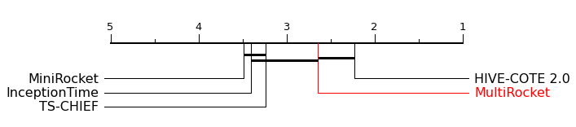
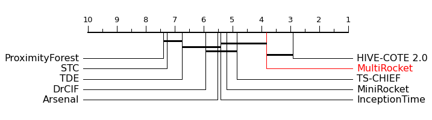
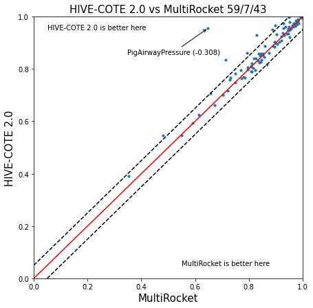
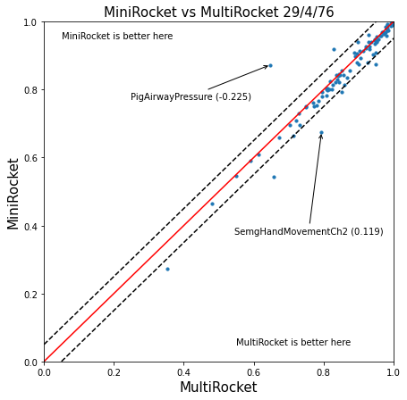
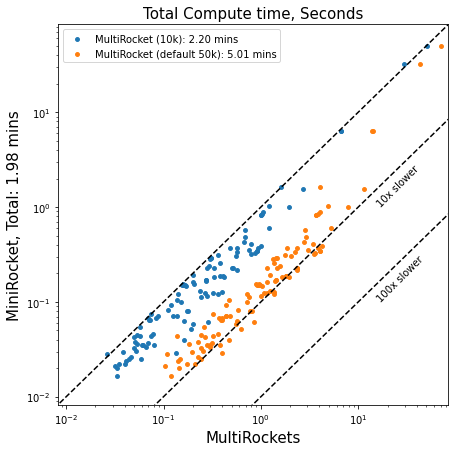
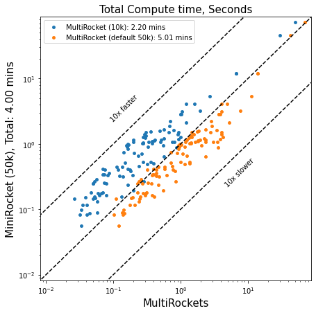

# MultiRocket

**Multiple pooling operators and transformations for fast and effective time series classification**

*Preprint*: [arxiv:2102.00457](https://arxiv.org/abs/2102.00457)

> <div align="justify">We propose MultiRocket, a fast time series classification (TSC) algorithm that achieves state-of-the-art performance with a tiny fraction of the time and without the complex ensembling structure of many state-of-the-art methods. MultiRocket improves on MiniRocket, one of the fastest TSC algorithms to date, by adding multiple pooling operators and transformations to improve the diversity of the features generated. In addition to processing the raw input series, MultiRocket also applies first order differences to transform the original series. Convolutions are applied to both representations, and four pooling operators are applied to the convolution outputs. When benchmarked using the University of California Riverside TSC benchmark datasets, MultiRocket is significantly more accurate than MiniRocket, and competitive with the best ranked current method in terms of accuracy, HIVE-COTE 2.0, while being orders of magnitude faster.</div>

## Reference
If you use any part of this work, please cite:
```
@article{Tan2021MultiRocket,
  title={{MultiRocket}: Multiple pooling operators and transformations for fast and effective time series classification},
  author={Tan, Chang Wei and Dempster, Angus and Bergmeir, Christoph and Webb, Geoffrey I},
  year={2021},
  journal={arxiv:2102.00457}
}
```

## Requirements
All python packages needed are listed in [requirements.txt](requirements.txt) file 
and can be installed simply using the pip command. 

* [pandas](https://pandas.pydata.org/)
* [numpy](https://numpy.org/)
* [numba](http://numba.pydata.org/) 
* [sklearn](https://scikit-learn.org/stable/)
* [catch22](https://github.com/chlubba/catch22) (optional)
* [sktime](https://github.com/alan-turing-institute/sktime) (required for MTSC)

## Code
The [main.py](main_ucr.py) file contains a simple code to run the program on a single UCR dataset.

The [main_ucr_109.py](main_ucr_109.py) file runs the program on all 109 UCR datasets.

The [main_mtsc.py](main_mtsc.py) file contains a simple code to run the program on a single [MTSC](http://timeseriesclassification.com/dataset.php) dataset.
```
Arguments:
-d --data_path          : path to dataset
-p --problem            : dataset name
-i --iter               : determines the resample of the UCR datasets
-n --num_features       : number of features 
-t --num_threads        : number of threads (> 0)
-s --save               : 0=don't save results, 1=save results
-v --verbose            : verbosity
``` 

## Results
These are the results on 30 resamples of the 109 UCR Time Series archive 
from the [UCR Time Series Classification Archive](https://www.cs.ucr.edu/~eamonn/time_series_data_2018/).
MultiRocket is on average the current most accurate scalable TSC algorithm, that is not significantly less accurate than
HIVE-COTE 2.0.

<p align="center">
  
</p>

<p align="center">
  
</p>

<p float="center" align="center">
  
  
</p>


The following shows the total compute time for 109 UCR datasets. 
Compute times are averaged over 30 resamples of 109 UCR datasets and run on a cluster using 32 threads on AMD EPYC 7702 CPUs.
<p float="center" align="center">
  
  
</p>

The following compares the total training time for 112 UCR datasets against some state of the arts.
The first four algorithms are computed using a single thread on AMD EPYC 7702 CPU. 
The rest of the results are obtained from the paper [HIVE-COTE 2.0: a new meta ensemble for time series classification](https://arxiv.org/abs/2104.07551)

<div align="center">

| TSC algorithm | Total train time |
|---------------|------------------|
| MiniRocket (default 10k features) | 2.44 minutes |
| MultiRocket (10k features) | 4.38 minutes |
| MiniRocket (50k features) | 5.25 minutes |
| MultiRocket (default 50k features) | 15.77 minutes |
| Rocket | 2.85 hours |
| Arsenal | 27.91 hours |
| DrCIF | 45.40 hours |
| TDE | 75.41 hours |
| InceptionTime (GPU) | 86.58 hours |
| STC | 115.88 hours |
| HIVE-COTE 2.0 | 340.21 hours |
| HIVE-COTE 1.0 | 427.18 hours |
| TS-CHIEF | 1016.87  hours |

</div>


The following table contains the averaged accuracy over 30 resamples of 109 UCR datasets, 
found in [results](results/all_resamples_average.csv). 
The results for other classifiers can also be obtained from [timeseriesclassification.com](http://timeseriesclassification.com/results.php).

|dataset_name|MultiRocket|MultiRocket_100k|MultiRocket_10k|Arsenal|BOSS|CIF|DrCIF|HIVE-COTE 2.0|HIVE-COTEv1_0|InceptionTime|MiniRocket|ProximityForest|RISE|ROCKET|ResNet|S-BOSS|STC|TDE|TS-CHIEF|TSF|WEASEL|cBOSS|
|------------|-----------|----------------|---------------|-------|----|---|-----|-------------|-------------|-------------|----------|---------------|----|------|------|------|---|---|--------|---|------|-----|
|ACSF1|0.833666667|0.834666667|0.826666667|0.805333333|0.768333333|0.767|0.784333333|0.833333333|0.85|0.826666667|0.822333333|0.638333333|0.76|0.807|0.824|0.815|0.838333333|0.797666667|0.807|0.635|0.818|0.757333333|
|Adiac|0.823103154|0.822421142|0.811167945|0.772122762|0.749019608|0.767263427|0.809633419|0.795140665|0.796248934|0.822250639|0.801705067|0.722165388|0.757971014|0.771952259|0.81543052|0.742710997|0.793179881|0.751577153|0.779710145|0.711935209|0.798806479|0.74629156|
|ArrowHead|0.895238095|0.896|0.893714286|0.862666667|0.868761905|0.82|0.825333333|0.886285714|0.876|0.880380952|0.880952367|0.883619048|0.828190476|0.859047619|0.858666667|0.887809524|0.806666667|0.900571429|0.881142857|0.796761905|0.848380952|0.877904762|
|BME|1|1|1|0.997555556|0.865777778|0.996888889|0.999555556|0.999555556|0.982222222|0.996444444|0.992222133|0.999111111|0.786|0.997333333|0.999111111|0.865111111|0.929777778|0.911555556|0.996444444|0.962444444|0.947777778|0.784666667|
|Beef|0.77|0.773333333|0.77|0.755555556|0.612222222|0.725555556|0.791111111|0.796666667|0.735555556|0.682222222|0.7611111|0.594444444|0.742222222|0.76|0.676666667|0.655555556|0.735555556|0.683333333|0.632222222|0.688888889|0.74|0.571111111|
|BeetleFly|0.896666667|0.895|0.895|0.886666667|0.943333333|0.868333333|0.878333333|0.903333333|0.963333333|0.893333333|0.906666667|0.86|0.871666667|0.885|0.853333333|0.936666667|0.933333333|0.941666667|0.958333333|0.833333333|0.886666667|0.975|
|BirdChicken|0.888333333|0.886666667|0.893333333|0.886666667|0.983333333|0.866666667|0.948333333|0.951666667|0.94|0.951666667|0.908333333|0.903333333|0.868333333|0.881666667|0.945|0.968333333|0.87|0.971666667|0.963333333|0.815|0.865|0.976666667|
|CBF|0.99262963|0.993|0.992555556|0.995962963|0.998925926|0.986481482|0.984777778|0.997925926|0.998259259|0.996111111|0.996222333|0.99362963|0.949037037|0.995925926|0.988222222|0.999074074|0.985296296|0.997407407|0.998444444|0.971851852|0.979777778|0.99837037|
|Car|0.92|0.922777778|0.918333333|0.915555556|0.848333333|0.812222222|0.843888889|0.907777778|0.868888889|0.901111111|0.9211111|0.805555556|0.753333333|0.911666667|0.908333333|0.859444444|0.858333333|0.87|0.878888889|0.766111111|0.834444444|0.843333333|
|Chinatown|0.966666667|0.966958212|0.966958212|0.967826087|0.877065112|0.963188406|0.979903382|0.973566569|0.962779397|0.964917396|0.968999|0.948019324|0.888532556|0.96686103|0.970144928|0.879105928|0.962973761|0.955458937|0.961835749|0.952964043|0.957337221|0.94763285|
|ChlorineConcentration|0.780711806|0.782586806|0.762274306|0.780286458|0.658246528|0.731579861|0.739427083|0.769019097|0.733949653|0.86359375|0.753350767|0.631137153|0.764756944|0.796137153|0.841006944|0.659114583|0.735225694|0.693402778|0.660842014|0.723064236|0.754861111|0.664956597|
|CinCECGTorso|0.949613527|0.947077295|0.949589372|0.865652174|0.914758454|0.987294686|0.993961353|0.998236715|0.993743961|0.832753623|0.875797133|0.937657005|0.947439614|0.864130435|0.767874396|0.94263285|0.977777778|0.98326087|0.953429952|0.958188406|0.984975845|0.829154589|
|Coffee|1|1|0.997619048|1|0.985714286|0.995238095|0.998809524|0.998809524|0.992857143|0.998809524|0.998809533|0.991666667|0.98452381|1|0.996428571|0.980952381|0.989285714|0.992857143|0.99047619|0.986904762|0.989285714|0.99047619|
|Computers|0.8508|0.8504|0.8412|0.842266667|0.800533333|0.7732|0.816666667|0.858533333|0.811066667|0.8656|0.793866667|0.714266667|0.778933333|0.842933333|0.8604|0.82|0.799066667|0.818133333|0.753866667|0.6488|0.778533333|0.7788|
|CricketX|0.82|0.822136752|0.815213675|0.833589744|0.762393162|0.762649573|0.772735043|0.83991453|0.816153846|0.853247863|0.825128233|0.80042735|0.706239316|0.838974359|0.808119658|0.784102564|0.792051282|0.814273504|0.83042735|0.692735043|0.775726496|0.764273504|
|CricketY|0.841709402|0.841367521|0.831709402|0.841452991|0.75042735|0.778376068|0.799059829|0.85042735|0.80982906|0.86|0.8413674|0.79982906|0.709145299|0.845042735|0.81017094|0.771367521|0.777948718|0.803333333|0.817008547|0.685897436|0.77957265|0.751282051|
|CricketZ|0.837692308|0.838974359|0.825128205|0.852307692|0.769316239|0.781880342|0.792393162|0.859487179|0.833931624|0.861111111|0.8424787|0.802820513|0.721623932|0.853247863|0.813247863|0.786752137|0.807179487|0.828461538|0.838205128|0.705897436|0.78991453|0.772478632|
|Crop|0.773912698|0.779380952|0.764305556|0.744916667|0.685688492|0.767365079|0.77727381|0.763886905|0.768162698|0.793194444|0.752248|0.753109127|0.73|0.751684524|0.763801587|0.707785714|0.736700397|0.724994048|0.76210119|0.745593254|0.723825397|0.700888889|
|DiatomSizeReduction|0.952178649|0.952287582|0.953485839|0.959259259|0.945206972|0.921568627|0.91459695|0.922331155|0.914270153|0.950653595|0.942810333|0.956753813|0.932135076|0.95795207|0.30620915|0.945424837|0.859259259|0.883986928|0.945860566|0.941721133|0.908061002|0.883551198|
|DistalPhalanxOutlineAgeGroup|0.8117506|0.812709832|0.816546763|0.816786571|0.820623501|0.818705036|0.821582734|0.820863309|0.823980815|0.765707434|0.8038368|0.802158273|0.821582734|0.811510791|0.776019185|0.821342926|0.79616307|0.795683453|0.828057554|0.809352518|0.792805755|0.805515588|
|DistalPhalanxOutlineCorrect|0.843115942|0.842149758|0.838405797|0.823188406|0.811714976|0.821618358|0.833816425|0.828381643|0.823550725|0.81557971|0.8213769|0.823429952|0.811231884|0.824396135|0.809178744|0.810990338|0.827294686|0.766425121|0.819323671|0.805797101|0.819202899|0.780193237|
|DistalPhalanxTW|0.70263789|0.702398082|0.699760192|0.700239808|0.67146283|0.697601919|0.697841727|0.701678657|0.69616307|0.665947242|0.6959232|0.692086331|0.694484412|0.701199041|0.667146283|0.669544365|0.689928058|0.665947242|0.691846523|0.691127098|0.678657074|0.673141487|
|ECG200|0.890666667|0.891666667|0.888666667|0.898666667|0.878333333|0.860666667|0.861|0.888666667|0.858666667|0.895666667|0.899333333|0.873|0.851|0.899|0.883666667|0.871666667|0.839|0.847333333|0.855|0.86|0.859|0.829666667|
|ECG5000|0.947059259|0.94682963|0.946488889|0.947133333|0.940059259|0.944066667|0.945637037|0.948014815|0.945622222|0.942051852|0.946133233|0.939511111|0.936688889|0.947385185|0.937022222|0.940696296|0.941777778|0.943422222|0.948459259|0.943377778|0.945881481|0.943214815|
|ECGFiveDays|0.995121951|0.994889663|0.994579946|0.996205962|0.99229578|0.954936121|0.988888889|0.99701897|0.993766938|0.99585753|0.9904763|0.882810685|0.972861014|0.995973674|0.951025939|0.992218351|0.977893922|0.984552846|0.994425087|0.951955091|0.99353465|0.983933411|
|EOGHorizontalSignal|0.866482505|0.867679558|0.855524862|0.807458564|0.706721915|0.771270718|0.795948435|0.815469613|0.795672192|0.883609576|0.836279933|0.824401473|0.624861878|0.813812155|0.864732965|0.708287293|0.75985267|0.722099448|0.853683241|0.705985267|0.74732965|0.720441989|
|EOGVerticalSignal|0.810773481|0.814732965|0.788213628|0.779558011|0.660313076|0.747237569|0.778268877|0.789871087|0.762983425|0.814548803|0.7980663|0.777624309|0.603499079|0.781123389|0.75174954|0.68305709|0.713167587|0.67320442|0.809484346|0.672559853|0.697513812|0.668692449|
|Earthquakes|0.748920863|0.748681055|0.747961631|0.748201439|0.746043165|0.74676259|0.748201439|0.748201439|0.747482014|0.732134293|0.748680667|0.749640288|0.748201439|0.748441247|0.717026379|0.747482014|0.741966427|0.74676259|0.748201439|0.747482014|0.747482014|0.747482014|
|ElectricDevices|0.900345826|0.896252107|0.894955259|0.890239052|0.797384689|0.872818052|0.882397441|0.898474041|0.879708641|0.890213115|0.8743656|0.842441534|0.824030606|0.893156962|0.888380236|0.805969827|0.881774954|0.831236761|0.865041283|0.79306186|0.871698439|0.813145723|
|EthanolLevel|0.712666667|0.723933333|0.691333333|0.620333333|0.508733333|0.803666667|0.775|0.835533333|0.849|0.875466667|0.664|0.324066667|0.661066667|0.625266667|0.852533333|0.5056|0.855733333|0.5336|0.6056|0.669266667|0.705066667|0.490733333|
|FaceAll|0.983609467|0.983530572|0.983984221|0.987771203|0.970098619|0.953333333|0.959428008|0.986725838|0.979723866|0.983313609|0.983451667|0.977061144|0.964852071|0.98800789|0.981854043|0.975069034|0.953688363|0.979013807|0.982721893|0.949960552|0.973116371|0.969033531|
|FaceFour|0.897348485|0.898484848|0.899242424|0.93219697|0.995454545|0.952272727|0.94280303|0.967045455|0.973106061|0.938636364|0.940151567|0.945454545|0.876893939|0.931439394|0.925|0.981818182|0.656439394|0.989015152|0.999621212|0.906818182|0.981060606|0.996969697|
|FacesUCR|0.970373984|0.970243902|0.96904065|0.971934959|0.951300813|0.909073171|0.915186992|0.974601626|0.961349593|0.976861789|0.9686505|0.956097561|0.89195122|0.971284553|0.964260163|0.95695935|0.910097561|0.961756097|0.972926829|0.90398374|0.956195122|0.952471545|
|FiftyWords|0.84014652|0.841978022|0.833772894|0.821758242|0.705860806|0.763296703|0.771501832|0.825787546|0.771648352|0.826813187|0.829010967|0.825934066|0.666593407|0.825054945|0.723956044|0.765054945|0.736556777|0.796556777|0.842710623|0.721684982|0.776996337|0.717875458|
|Fish|0.983428571|0.983619048|0.981714286|0.977142857|0.969714286|0.927428571|0.942095238|0.982285714|0.979428571|0.972571429|0.975047667|0.933904762|0.859047619|0.974095238|0.969904762|0.971238095|0.949904762|0.979428571|0.98152381|0.83047619|0.950857143|0.97447619|
|FordA|0.956035354|0.958030303|0.952828283|0.943813131|0.921363636|0.908308081|0.967020202|0.953989899|0.944116162|0.959141414|0.948181933|0.850025253|0.940025253|0.942449495|0.931515152|0.907575758|0.934242424|0.933131313|0.94739899|0.815757576|0.968686869|0.915732323|
|FordB|0.931851852|0.933580247|0.928271605|0.919588477|0.90744856|0.883621399|0.921316872|0.930329218|0.928024691|0.94090535|0.926790133|0.839382716|0.917325103|0.923004115|0.912798354||0.919835391|0.914650206|0.919465021|0.790658436|0.937119342|0.895473251|
|FreezerRegularTrain|0.998339181|0.997929825|0.997824561|0.995391813|0.98805848|0.998994152|0.999403509|0.999883041|0.999087719|0.995754386|0.9991227|0.942350877|0.95225731|0.994374269|0.996736842|0.976105263|0.999251462|0.995321637|0.998491228|0.997076023|0.990608187|0.993929825|
|FreezerSmallTrain|0.991976608|0.991391813|0.991918129|0.99019883|0.961637427|0.998690058|0.99922807|0.998187135|0.983660819|0.948912281|0.9873216|0.823380117|0.878725146|0.987204678|0.949473684|0.947602339|0.988561404|0.962619883|0.995461988|0.961438596|0.900573099|0.966818713|
|GunPoint|0.997777778|0.997555556|0.997333333|0.993111111|0.996444444|0.981333333|0.989333333|0.998888889|0.998222222|0.995111111|0.9924443|0.991333333|0.980888889|0.992|0.990888889|0.996666667|0.986444444|1|1|0.955333333|0.993111111|0.999777778|
|GunPointAgeSpan|0.995991561|0.996097046|0.995886076|0.993670886|0.994936709|0.983966245|0.984493671|0.995675105|0.996624473|0.983860759|0.992299467|0.996940928|0.98628692|0.993459916|0.994409283|0.99535865|0.966033755|0.998839662|0.999578059|0.977742616|0.981329114|0.998628692|
|GunPointMaleVersusFemale|1|1|1|0.99978903|0.999578059|0.997468354|0.998734177|1|0.999894515|0.998312236|0.9998945|0.999367089|0.991139241|0.999894515|0.990084388|0.999578059|0.98649789|0.998839662|0.999367089|0.995991561|0.993881857|0.999156118|
|GunPointOldVersusYoung|1|1|1|0.989100529|0.999153439|1|1|1|1|1|1|1|0.99978836|0.98962963|1|0.999153439|0.978306878|0.998941799|1|1|0.986031746|0.999153439|
|Ham|0.843809524|0.843809524|0.829206349|0.86|0.837460317|0.823809524|0.821587302|0.858730159|0.84|0.85015873|0.8447618|0.783492063|0.81968254|0.855238095|0.807301587|0.834920635|0.810793651|0.82|0.805079365|0.799365079|0.821269841|0.811428571|
|Haptics|0.550757576|0.55021645|0.550649351|0.532683983|0.467424242|0.503354978|0.519047619|0.546753247|0.539393939|0.536580087|0.546212133|0.458333333|0.478787879|0.534199134|0.496536797|0.492207792|0.541666667|0.525541126|0.523268398|0.465584416|0.449242424|0.480194805|
|Herring|0.613020833|0.615625|0.615625|0.623958333|0.595833333|0.606770833|0.595833333|0.626041667|0.611979167|0.625|0.609375|0.574479167|0.5984375|0.625|0.596875|0.608333333|0.6328125|0.6015625|0.597395833|0.604166667|0.602083333|0.574479167|
|HouseTwenty|0.975910364|0.975630252|0.977871148|0.964145658|0.956022409|0.937535014|0.940056022|0.98627451|0.978711485|0.953501401|0.965826433|0.93697479|0.929691877|0.962745098|0.955462185|0.929691877|0.975070028|0.988515406|0.970308123|0.837815126|0.810644258|0.93977591|
|InlineSkate|0.48169697|0.482727273|0.480848485|0.465575758|0.505636364|0.454363636|0.561212121|0.545575758|0.515151515|0.534363636|0.4646667|0.561030303|0.390424242|0.437939394|0.410121212|0.514242424|0.439272727|0.533818182|0.571878788|0.372787879|0.674606061|0.503454545|
|InsectEPGRegularTrain|1|1|1|0.987014726|0.996787149|1|1|1|1|1|1|1|0.992904953|0.987014726|1|0.977376171|0.993440428|0.999330656|1|1|0.971753681|1|
|InsectEPGSmallTrain|0.995983936|0.996251673|0.996117805|0.934270415|0.984872825|0.995983936|0.99437751|0.998527443|1|1|0.9934405|1|0.972155288|0.934270415|0.396251673|0.975502008|0.88768407|0.999062918|1|0.995850067|0.90669344|0.990896921|
|InsectWingbeatSound|0.671700337|0.671666667|0.671430976|0.657828283|0.511835017|0.648181818|0.661986532|0.661868687|0.64026936|0.627340067|0.6596801|0.606902357|0.636363636|0.656683502|0.491380471|0.518686869|0.628552189|0.582474747|0.632222222|0.603451178|0.619494949|0.538989899|
|ItalyPowerDemand|0.964496275|0.964820214|0.964528669|0.961483641|0.870877875|0.962876579|0.965079365|0.961839974|0.958179462|0.960349854|0.959572433|0.95600907|0.944541626|0.961613217|0.957110463|0.86835115|0.953806284|0.948817622|0.962423064|0.959475219|0.9468092|0.926465824|
|LargeKitchenAppliances|0.941422222|0.940533333|0.934488889|0.928533333|0.835822222|0.867288889|0.867377778|0.935288889|0.920088889|0.952355556|0.903200033|0.810133333|0.735822222|0.930044444|0.953866667|0.836977778|0.929866667|0.840088889|0.860177778|0.636266667|0.792711111|0.836977778|
|Lightning2|0.750819672|0.751912568|0.744262295|0.77431694|0.819125683|0.764480874|0.756830601|0.783606557|0.773224044|0.816393443|0.751912467|0.84863388|0.681967213|0.776502732|0.800546448|0.808196721|0.658469945|0.774863388|0.768852459|0.764480874|0.627322404|0.79726776|
|Lightning7|0.79543379|0.792694064|0.77716895|0.797716895|0.671232877|0.742922374|0.752511416|0.797716895|0.757534247|0.821461187|0.7789955|0.792237443|0.697716895|0.797716895|0.810045662|0.681278539|0.743378995|0.705479452|0.793607306|0.720547945|0.712785388|0.720091324|
|Mallat|0.951656006|0.952793177|0.955024876|0.957725657|0.949793888|0.970675195|0.978464819|0.979061834|0.967192608|0.962487562|0.955892033|0.972011372|0.954072495|0.957171286|0.968969439|0.948457711|0.908031272|0.880341151|0.976702203|0.935721393|0.966439232|0.940909737|
|Meat|0.982777778|0.985555556|0.982777778|0.990555556|0.980555556|0.986666667|0.983333333|0.990555556|0.986111111|0.983888889|0.9933333|0.987222222|0.986666667|0.988888889|0.993888889|0.983888889|0.967777778|0.980555556|0.984444444|0.983888889|0.976666667|0.977222222|
|MedicalImages|0.809078947|0.811798246|0.803377193|0.804605263|0.715833333|0.768157895|0.795964912|0.809605263|0.740350877|0.796315789|0.804385933|0.771447368|0.666710526|0.805131579|0.792236842|0.716798246|0.709824561|0.756842105|0.799122807|0.74622807|0.70877193|0.689605263|
|MiddlePhalanxOutlineAgeGroup|0.721428571|0.721212121|0.723809524|0.715151515|0.656277056|0.691558442|0.71017316|0.717532468|0.697835498|0.594588745|0.708008667|0.658874459|0.69978355|0.710822511|0.596536797|0.659090909|0.667532468|0.693506493|0.694372294|0.65952381|0.66038961|0.677489177|
|MiddlePhalanxOutlineCorrect|0.848109966|0.850973654|0.84467354|0.832760596|0.809507446|0.802634593|0.826345934|0.836311569|0.812943872|0.834020619|0.842726267|0.824054983|0.805498282|0.834478809|0.823596793|0.806643757|0.831500573|0.765635739|0.805841924|0.79954181|0.828293242|0.772164948|
|MiddlePhalanxTW|0.58982684|0.590692641|0.593939394|0.591558442|0.532251082|0.580735931|0.59025974|0.592424242|0.583766234|0.526623377|0.590909267|0.549134199|0.585064935|0.58982684|0.531168831|0.541558442|0.578571429|0.577922078|0.573160173|0.568614719|0.554329004|0.567316017|
|MixedShapesRegularTrain|0.978694158|0.978597938|0.977896907|0.965333333|0.917910653|0.952398625|0.958611684|0.972893471|0.965924399|0.966295533|0.969360833|0.96380756|0.937704467|0.96566323|0.970075601|0.932068729|0.960233677|0.972646048|0.971381443|0.922996564|0.963285223|0.933924399|
|MixedShapesSmallTrain|0.9524811|0.952439863|0.95228866|0.931477663|0.871697595|0.909457045|0.914749141|0.951642612|0.944687285|0.913360825|0.941388233|0.928054983|0.898281787|0.930680412|0.916247423|0.929773196|0.936810997|0.953099656|0.947257732|0.840151203|0.924467354|0.893127148|
|MoteStrain|0.902981896|0.902529286|0.905378062|0.905644302|0.844195953|0.905138445|0.908280085|0.932747604|0.936501597|0.880644302|0.912912633|0.914962726|0.878035144|0.905484558|0.903115016|0.850985091|0.908892439|0.899201278|0.930111821|0.855457934|0.904765708|0.896698616|
|OSULeaf|0.961707989|0.961019284|0.957300275|0.939669421|0.969146006|0.744903581|0.860606061|0.965564738|0.974793388|0.95261708|0.957575733|0.858539945|0.654269972|0.938705234|0.974655647|0.976859504|0.956336088|0.954958678|0.973553719|0.643250689|0.851790634|0.960055096|
|OliveOil|0.913333333|0.913333333|0.901111111|0.897777778|0.875555556|0.91|0.905555556|0.903333333|0.883333333|0.874444444|0.914444467|0.878888889|0.893333333|0.902222222|0.862222222|0.874444444|0.878888889|0.893333333|0.916666667|0.893333333|0.913333333|0.874444444|
|PhalangesOutlinesCorrect|0.857575758|0.857187257|0.845687646|0.843356643|0.817365967|0.828321678|0.844483294|0.845415695|0.826495726|0.861499611|0.842229933|0.829098679|0.812509713|0.844716395|0.847668998|0.818881119|0.833682984|0.778049728|0.825330225|0.805710956|0.821717172|0.779176379|
|Phoneme|0.35302391|0.349525316|0.351547117|0.273857243|0.254606188|0.366279888|0.413800985|0.39092827|0.37116737|0.334616737|0.2718706|0.320411392|0.346624473|0.275140647|0.345675105|0.279588608|0.356522504|0.348329817|0.369848805|0.193653305|0.25947609|0.272609001|
|PigAirwayPressure|0.647275641|0.656410256|0.571955128|0.162339744|0.941826923|0.314583333|0.289903846|0.955448718|0.957692308|0.922115385|0.8727564|0.275480769|0.182532051|0.195512821|0.437019231|0.957371795|0.977403846|0.945512821|0.960096154|0.280128205|0.537820513|0.950961538|
|PigArtPressure|0.927884615|0.924038462|0.917467949|0.908814103|0.967628205|0.785576923|0.858333333|0.973237179|0.966826923|0.933173077|0.962499967|0.715705128|0.794551282|0.90849359|0.953685897|0.975|0.945673077|0.979166667|0.968910256|0.307211538|0.937820513|0.962179487|
|PigCVP|0.828044872|0.830128205|0.809615385|0.881089744|0.959455128|0.485416667|0.635096154|0.92900641|0.953044872|0.905288462|0.9185898|0.500480769|0.682532051|0.881730769|0.45400641|0.958012821|0.899679487|0.938942308|0.961378205|0.178205128|0.897916667|0.952884615|
|Plane|1|1|1|1|0.998095238|0.998412698|1|1|1|0.996825397|1|1|0.996507937|1|1|0.997777778|0.999047619|1|1|0.995873016|0.994920635|1|
|PowerCons|0.977037037|0.976851852|0.976481481|0.954814815|0.89|0.991851852|0.988888889|0.968888889|0.992407407|0.986111111|0.983703633|0.987407407|0.957962963|0.956111111|0.886111111|0.897037037|0.940555556|0.938333333|0.979444444|0.993148148|0.919444444|0.897592593|
|ProximalPhalanxOutlineAgeGroup|0.853170732|0.853495935|0.854308943|0.851382114|0.828455285|0.853170732|0.850081301|0.85398374|0.855934959|0.822113821|0.856585567|0.840162602|0.857235772|0.852357724|0.817398374|0.832520325|0.845528455|0.857886179|0.846341463|0.84504065|0.844878049|0.849756098|
|ProximalPhalanxOutlineCorrect|0.905269187|0.907216495|0.899770905|0.896105384|0.865521191|0.877892325|0.894730813|0.896334479|0.885223368|0.906300115|0.8941581|0.865864834|0.873654066|0.899312715|0.905612829|0.866208477|0.895303551|0.867697594|0.875486827|0.848911798|0.87628866|0.864604811|
|ProximalPhalanxTW|0.80796748|0.804065041|0.804715447|0.803577236|0.768617886|0.810731707|0.81300813|0.811219512|0.816097561|0.780650407|0.8021138|0.790731707|0.813170732|0.803577236|0.789430894|0.774634146|0.807642276|0.801788618|0.811056911|0.801626016|0.801463415|0.794634146|
|RefrigerationDevices|0.731288889|0.733511111|0.722844444|0.716533333|0.782844444|0.698488889|0.740177778|0.767022222|0.790933333|0.759377778|0.6969779|0.672355556|0.651822222|0.729955556|0.786844444|0.7784|0.777155556|0.770755556|0.726844444|0.611644444|0.739733333|0.762933333|
|Rock|0.86|0.861333333|0.857333333|0.804|0.802666667|0.866|0.864666667|0.888666667|0.855333333|0.627333333|0.815333333|0.774666667|0.782|0.804666667|0.416|0.826|0.867333333|0.875333333|0.832|0.76|0.854666667|0.801333333|
|ScreenType|0.657688889|0.655911111|0.638222222|0.5968|0.5848|0.615911111|0.669866667|0.707022222|0.724177778|0.7056|0.542222233|0.572|0.605866667|0.608977778|0.755288889|0.588977778|0.717866667|0.643555556|0.594222222|0.471822222|0.595911111|0.577066667|
|SemgHandGenderCh2|0.949444444|0.950222222|0.938055556|0.924833333|0.887666667|0.9515|0.952111111|0.961277778|0.969166667|0.884555556|0.9098889|0.963111111|0.87|0.923111111|0.808888889|0.885166667|0.932277778|0.880277778|0.938888889|0.947388889|0.781444444|0.879111111|
|SemgHandMovementCh2|0.794296296|0.796518519|0.750222222|0.640592593|0.664888889|0.87637037|0.875259259|0.861925926|0.888962963|0.551037037|0.675036967|0.890888889|0.724|0.652592593|0.420962963|0.681777778|0.788296296|0.707481482|0.884962963|0.864148148|0.460296296|0.692148148|
|SemgHandSubjectCh2|0.926888889|0.927259259|0.906222222|0.914222222|0.835111111|0.931925926|0.933185185|0.938888889|0.950592593|0.763925926|0.878666667|0.938074074|0.824148148|0.911851852|0.554740741|0.842740741|0.913333333|0.866074074|0.933111111|0.916|0.793481481|0.845407407|
|ShapeletSim|1|1|1|0.997777778|1|0.96|0.973333333|1|1|0.923518519|0.9996296|0.789259259|0.767592593|0.998148148|0.727222222|1|0.99962963|0.995|1|0.513703704|0.997407407|0.985185185|
|ShapesAll|0.946|0.944833333|0.940333333|0.923555556|0.9085|0.860166667|0.874666667|0.934277778|0.931277778|0.938166667|0.934777767|0.890055556|0.850055556|0.923222222|0.933055556|0.920444444|0.865333333|0.931833333|0.941055556|0.804277778|0.916|0.904055556|
|SmallKitchenAppliances|0.825422222|0.8288|0.820266667|0.817955556|0.747111111|0.832888889|0.844622222|0.841244444|0.828266667|0.770577778|0.8133333|0.738133333|0.805955556|0.818311111|0.796622222|0.790933333|0.8128|0.811644444|0.837955556|0.788177778|0.805244444|0.773777778|
|SmoothSubspace|0.979555556|0.978222222|0.979777778|0.974888889|0.407333333|0.990888889|0.988444444|0.982666667|0.986222222|0.984888889|0.957999967|0.998|0.848444444|0.974888889|0.992888889|0.411777778|0.935777778|0.874222222|0.997333333|0.987333333|0.855333333|0.444|
|SonyAIBORobotSurface1|0.947975596|0.94786467|0.949195785|0.957903494|0.897670549|0.869495286|0.917803661|0.952190793|0.826344981|0.954187465|0.948031133|0.920133111|0.866999445|0.958069884|0.960399334|0.895341098|0.800942873|0.710094287|0.889739323|0.863727121|0.909262341|0.622850804|
|SonyAIBORobotSurface2|0.949003148|0.948863239|0.947604057|0.935362015|0.879363414|0.908674362|0.928681357|0.947219307|0.936656173|0.95127667|0.941727933|0.899020637|0.912486884|0.935047219|0.968870234|0.884260231|0.936970969|0.904756908|0.901084295|0.874326688|0.93529206|0.875795733|
|StarLightCurves|0.981196374|0.981398737|0.980957585|0.981257083|0.976578436|0.979164643|0.979779828|0.981686094|0.979557228|0.978124494|0.981220667|0.97956937|0.974380767|0.98099401|0.972029302|0.952096487|0.978606119|0.977679294|0.98112757|0.970426582|0.980431439|0.977752145|
|Strawberry|0.978918919|0.979189189|0.978288288|0.979459459|0.97045045|0.975585586|0.973783784|0.978918919|0.975135135|0.975495495|0.979819767|0.96045045|0.972972973|0.978738739|0.974864865|0.966036036|0.971711712|0.973513514|0.973963964|0.967477477|0.978558559|0.972162162|
|SwedishLeaf|0.972373333|0.97264|0.969173333|0.959786667|0.92016|0.937706667|0.960426667|0.96352|0.94944|0.969813333|0.962933333|0.953066667|0.922933333|0.9632|0.95856|0.92544|0.933973333|0.93744|0.96192|0.897866667|0.9576|0.91056|
|Symbols|0.97319933|0.972328308|0.972495812|0.96760469|0.96318258|0.949145729|0.952227806|0.971457286|0.968509213|0.969480737|0.966834|0.967035176|0.912730318|0.968576214|0.946700168|0.964154104|0.901407035|0.967035176|0.970820771|0.877889447|0.953232831|0.962512563|
|SyntheticControl|0.995|0.994777778|0.993111111|0.997333333|0.966555556|0.991222222|0.994|0.998444444|0.994222222|0.995777778|0.990111167|0.998333333|0.677888889|0.997777778|0.994444444|0.964888889|0.991888889|0.987111111|0.999|0.991555556|0.987|0.951111111|
|ToeSegmentation1|0.927923977|0.92748538|0.925146199|0.930555556|0.924853801|0.859502924|0.901461988|0.955409357|0.959649123|0.953216374|0.941081733|0.835526316|0.880409357|0.932894737|0.954239766|0.920321637|0.953362573|0.959064328|0.959795322|0.667105263|0.942982456|0.951754386|
|ToeSegmentation2|0.935897436|0.936666667|0.932564103|0.931538462|0.961538462|0.897948718|0.897435897|0.96025641|0.968205128|0.963589744|0.939999967|0.885897436|0.911794872|0.932564103|0.953076923|0.963076923|0.945128205|0.973846154|0.962564103|0.802564103|0.928461538|0.964871795|
|Trace|1|1|1|1|1|1|1|1|1|1|1|1|0.983|1|1|1|1|1|1|0.992|1|1|
|TwoLeadECG|0.997570969|0.9976295|0.997922154|0.998478197|0.984723442|0.921480831|0.984957565|0.999034241|0.996283289|0.994820018|0.997248933|0.981796898|0.910740416|0.998536728|0.999443957|0.985601405|0.999122037|0.997980685|0.990079017|0.870646766|0.997541703|0.993766462|
|TwoPatterns|1|1|0.999991667|1|0.991691667|0.99895|0.999691667|1|0.999483333|1|0.995283333|0.999991667|0.438966667|1|0.999775|0.99575|0.990258333|0.997391667|0.999991667|0.993825|0.9814|0.99205|
|UMD|0.982407407|0.980092593|0.984027778|0.981481481|0.966435185|0.906944444|0.915740741|0.98587963|0.967361111|0.979861111|0.990277967|0.954398148|0.541203704|0.98287037|0.952546296|0.93912037|0.936805556|0.918287037|0.983333333|0.833333333|0.932175926|0.921759259|
|UWaveGestureLibraryAll|0.984347664|0.984189466|0.983240275|0.975227992|0.944853899|0.972389726|0.971877908|0.974865066|0.966620138|0.951172529|0.9749116|0.973059743|0.917373907|0.977265959|0.868993114|0.947710776|0.957965755|0.954075935|0.970742602|0.962367393|0.957761027|0.944853899|
|UWaveGestureLibraryX|0.875060488|0.875507165|0.866378187|0.856523358|0.752587009|0.830764936|0.845049321|0.860348036|0.833454309|0.833603201|0.8560488|0.831397729|0.633947515|0.857128234|0.790396427|0.788172343|0.820165643|0.827033315|0.846780197|0.799990694|0.817606551|0.774055462|
|UWaveGestureLibraryY|0.807686581|0.808030895|0.797031454|0.78323097|0.662125442|0.766192071|0.775041876|0.789456542|0.754680811|0.770630932|0.783398567|0.767215708|0.668220733|0.783631119|0.67585148|0.714824121|0.74491904|0.764628699|0.788023451|0.721877908|0.725823562|0.694369998|
|UWaveGestureLibraryZ|0.81652708|0.818220733|0.809826912|0.79580309|0.695495999|0.776214405|0.78884236|0.803294249|0.77514424|0.773208636|0.800325633|0.767383212|0.66352131|0.795831007|0.751386562|0.736376326|0.772473479|0.783696259|0.791178113|0.73340778|0.754820398|0.710580681|
|Wafer|0.999718797|0.999735021|0.999675535|0.998583171|0.998907636|0.998940082|0.999605235|1|0.999859399|0.998621025|0.998978033|0.996144279|0.995354748|0.998648064|0.998880597|0.999042829|0.999978369|0.999837768|0.998923859|0.996593121|0.999913476|0.998929267|
|Wine|0.92037037|0.916666667|0.92654321|0.922839506|0.892592593|0.878395062|0.874074074|0.924691358|0.891975309|0.886419753|0.927777633|0.85617284|0.870987654|0.914197531|0.85617284|0.89382716|0.885802469|0.888888889|0.898148148|0.862345679|0.930246914|0.877777778|
|WordSynonyms|0.78615465|0.787251829|0.77215256|0.758777429|0.658411703|0.68631139|0.695245559|0.766196447|0.693155695|0.751776385|0.767554867|0.77816092|0.591640543|0.764420063|0.613322884|0.737565308|0.623040752|0.755485893|0.793678161|0.647910136|0.712748171|0.667816092|
|Worms|0.72987013|0.729437229|0.729004329|0.714718615|0.725541126|0.708225108|0.748484848|0.758008658|0.716450216|0.77965368|0.7294375|0.693073593|0.686580087|0.72034632|0.758874459|0.717316017|0.733333333|0.741991342|0.768398268|0.612121212|0.778354978|0.662337662|
|WormsTwoClass|0.796536797|0.791341991|0.798268398|0.774458874|0.807792208|0.798701298|0.803463203|0.805194805|0.78961039|0.803463203|0.7926409|0.769264069|0.785281385|0.78961039|0.767965368|0.807792208|0.785281385|0.815151515|0.786147186|0.693506494|0.8004329|0.790909091|
|Yoga|0.931877778|0.932011111|0.9251|0.912255556|0.910155556|0.874255555|0.8898|0.930033333|0.912433333|0.912311111|0.918688933|0.887444444|0.8372|0.913844444|0.877211111|0.915055556|0.879988889|0.928633333|0.872633333|0.8658|0.892377778|0.912122222|

[Here](results/results_128_resample_0.csv) are the results for some MultiRocket variants on the full 128 UCR datasets.

[Here](results/resamples/) are the results for some MultiRocket variants on 30 resamples of 109 UCR datasets.


## Acknowledgement
We would like to thank Professor Eamonn Keogh, Professor Tony Bagnall and their team who have provided the 
[UCR time series classification archive](https://www.cs.ucr.edu/~eamonn/time_series_data_2018/) and 
making a comprehensive benchmark [results](http://timeseriesclassification.com/results.php) widely available.
We also appreciate the open source code to draw the critical difference diagrams from 
[Hassan Fawaz](https://github.com/hfawaz/cd-diagram).
